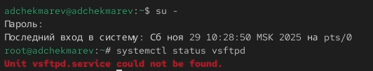
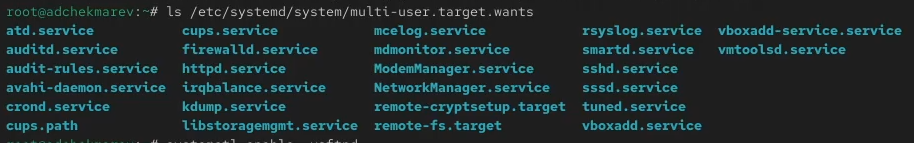
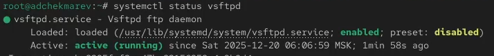
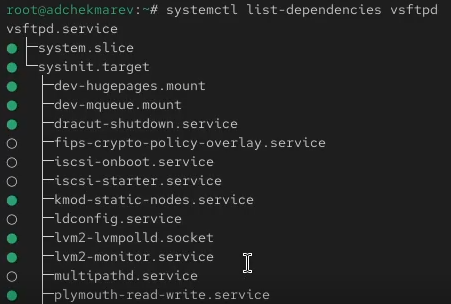
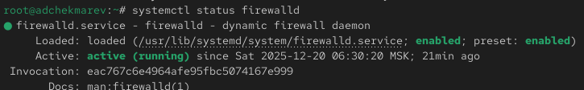
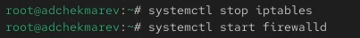
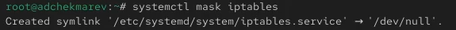
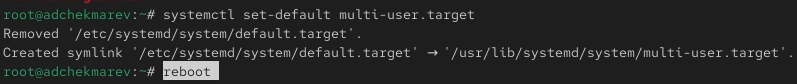

---
## Front matter
lang: ru-RU
title: Лабораторная работа №5
subtitle: Управление системными службами
author:
  - Чекмарев Александр Дмитриевич | Группа НПИбд-03-24
institute:
  - Российский университет дружбы народов, Москва, Россия
date: 20 Декабря 2025

## i18n babel
babel-lang: russian
babel-otherlangs: english

## Formatting pdf
toc: false
toc-title: Содержание
slide_level: 2
aspectratio: 169
section-titles: true
theme: warsaw

## Fonts
mainfont: Liberation Serif
romanfont: Liberation Serif
sansfont: Liberation Sans
monofont: Liberation Mono
mainfontoptions: Ligatures=TeX
romanfontoptions: Ligatures=TeX
sansfontoptions: Ligatures=TeX,Scale=MatchLowercase
monofontoptions: Scale=MatchLowercase,Scale=0.9
---

# Информация

## Докладчик

:::::::::::::: {.columns align=center}
::: {.column width="70%"}

  * Чекмарев Александр Дмитриевич
  * Группа НПИбд-03-24
  * Российский университет дружбы народов
  * <https://github.com/nenokixd?tab=repositories>

:::
::: {.column width="30%"}

:::
::::::::::::::

# Вводная часть

## Объект и предмет исследования

- Управления системными службами операционной системы посредством systemd

## Цель работы

- Получить навыки управления системными службами операционной системы посредством systemd.

# Ход лаборатороной работы

## Управление сервисами

- Зайдем в режим root. Проверяем статус службы Very Secure FTP: **systemctl status vsftpd**. 
- Вывод команды показывает, что сервис в настоящее время отключён, так как служба Very Secure FTP не установлена 

{#fig:001 width=60%}

## Управление сервисами

- Устанавливаем службу Very Secure FTP: **dnf -y install vsftpd** 

{#fig:001 width=65%} 

## Управление сервисами

- Запускаем службу Very Secure FTP. Проверяем статус службы Very Secure FTP. 
- Вывод команды показывает, что служба в настоящее время работает, но не будет активирована при перезапуске операционной системы 

{#fig:001 width=65%}

## Управление сервисами

- Добавляем службу Very Secure FTP в автозапуск при загрузке операционной системы, используя команду: **systemctl enable vsftpd**
- Проверяем статус службы Very Secure FTP 

{#fig:001 width=65%}

## Управление сервисами

- Удаляем службу из автозапуска, используя команду **systemctl disable vsftpd**, и снова проверяем её статус 

{#fig:001 width=65%}

## Управление сервисами

- Выводим на экран символические ссылки, ответственные за запуск различных сервисов: **ls /etc/systemd/system/multi-user.target.wants**. 
- После ввода этой команды отображается, что ссылки на vsftpd.service не существует 

{#fig:001 width=75%}

## Управление сервисами

- Снова добавляем службу Very Secure FTP в автозапуск и опять выводим на экран символические ссылки, ответственные за запуск различных сервисов. 
- На этот раз вывод команды показывает, что создана символическая ссылка для файла /usr/lib/systemd/system/vsftpd.service в каталоге /etc/systemd/system/multi-user.target.wants 

{#fig:001 width=65%}

## Управление сервисами

- Проверяем статус службы Very Secure FTP. Мы видим, что для файла юнита состояние изменено с disabled на enabled 

{#fig:001 width=70%}

## Управление сервисами

- Выводим на экран список зависимостей юнита: **systemctl list-dependencies vsftpd**

{#fig:001 width=70%}

## Управление сервисами

- Выводим на экран список юнитов, которые зависят от данного юнита: **systemctl list-dependencies vsftpd --reverse** 

{#fig:001 width=70%}

## Конфликты юнитов

- Устанавливаем iptables: **dnf -y install iptables\* **

{#fig:001 width=70%}

## Конфликты юнитов

- Далее проверяем статус firewalld и iptables 

{#fig:001 width=50%}

{#fig:001 width=50%}

## Конфликты юнитов

- Далее пробуем запустить firewalld и iptables. При запуске одной службы мы видим, что вторая дезактивируется или не запускается

{#fig:001 width=70%}

## Конфликты юнитов

- Вводим **cat /usr/lib/systemd/system/firewalld.service**.  
- Описание настроек конфликтов: Conflicts=iptables.service ebtables.service ipset.service nftables.service. 
- Этот параметр задает службы, которые конфликтуют с firewalld. Это означает, что одновременно с firewalld не могут быть запущены службы iptables.service, ebtables.service, ipset.service и nftables.service. 

{#fig:001 width=60%}

## Конфликты юнитов

- Вводим **cat /usr/lib/systemd/system/iptables.service**. 
- Описание настроек конфликтов: в данном юните параметр Conflicts отсутствует, что означает, что конфликтов с другими службами не указано. 
- Хотя в юните iptables не указаны конфликты, мы знаем из предыдущей конфигурации firewalld, что firewalld указывает iptables как конфликтующую службу. 
- Это означает, что если firewalld работает, то iptables не должен быть запущен одновременно, так как это может привести к конфликтам в управлении firewalld. 

{#fig:001 width=60%}

## Конфликты юнитов

- Выгружаем службу iptables (на всякий случай, чтобы убедиться, что данная служба не загружена в систему): **systemctl stop iptables**. 
- После загружаем службу firewalld 

{#fig:001 width=70%}

## Конфликты юнитов

- Далее блокируем запуск iptables, введя: **systemctl mask iptables**. 
- При этом будет создана символическая ссылка на /dev/null для /etc/systemd/system/iptables.service. 
- Поскольку юнитфайлы в /etc/systemd имеют приоритет над файлами в /usr/lib/systemd, то это сделает невозможным случайный запуск сервиса iptables 

{#fig:001 width=50%}

## Конфликты юнитов

- Пробуем запустить iptables м добавить iptables в автозапуск.
- При попытке запустить iptables появляется сообщение об ошибке, указывающее, что служба замаскирована и по этой причине не может быть запущена. 
- Сервис будет неактивен, а статус загрузки отобразится как замаскированный.

{#fig:001 width=50%} 

## Изолируемые цели

- Переходим в каталог systemd и находим список всех целей, которые можно изолировать:

{#fig:001 width=70%}

## Изолируемые цели

- Далее переключаем операционную систему в режим восстановления: **systemctl isolate rescue.target** 
- Переходим в режим root и перезапускаем операционную систему: **systemctl isolate reboot.target**
- У меня не выводит консоль, я не знаю что делать, поэтому эти два пункта пропущены.

## Цель по умолчанию

- Получаем права администратора. Далее выводим на экран цель, установленную по умолчанию: **systemctl get-default**. 
- Сейчас графический режим 

{#fig:001 width=70%}

## Цель по умолчанию

- Для установки цели по умолчанию используется команда **systemctl set-default**. 
- Запускаем по умолчанию текстовый режим введя команду **systemctl set-default multi-user.target** и перезагружаем систему командой **reboot** 

{#fig:001 width=90%}

## Цель по умолчанию

- Система загрузилась в текстовом режиме. 
- Получаем полномочия пользователя root и запускаем по умолчанию графический режим введя команду **systemctl set-default graphical.target**. 
- Снова перезагружаем систему командой **reboot** 

{#fig:001 width=60%}

- Система загрузилась в графическом режиме.

## Вывод:

В ходе работы приобретены умения по работе с управлением системными службами операционной системы посредством systemd
