---
# Preamble

## Author
author:
  name: Чекмарев Александр Дмитриевич | группа НПИбд 03-24
  affiliation:
    - name: Российский университет дружбы народов
      country: Российская Федерация
   
## Title
title: "Лабораторная работа №5"
subtitle: "Управление системными службами"
license: "CC BY"
## Generic options
lang: ru-RU
number-sections: true
toc: true
toc-title: "Содержание"
toc-depth: 2
## Crossref customization
crossref:
  lof-title: "Список иллюстраций"
  lot-title: "Список таблиц"
  lol-title: "Листинги"
## Bibliography
bibliography:
  - bib/cite.bib
csl: _resources/csl/gost-r-7-0-5-2008-numeric.csl
## Formats
format:
### Pdf output format
  pdf:
    toc: true
    number-sections: true
    colorlinks: false
    toc-depth: 2
    lof: true # List of figures
    lot: true # List of tables
#### Document
    documentclass: scrreprt
    papersize: a4
    fontsize: 12pt
    linestretch: 1.5
#### Language
    babel-lang: russian
    babel-otherlangs: english
#### Biblatex
    cite-method: biblatex
    biblio-style: gost-numeric
    biblatexoptions:
      - backend=biber
      - langhook=extras
      - autolang=other*
#### Misc options
    csquotes: true
    indent: true
    header-includes: |
      \usepackage{indentfirst}
      \usepackage{float}
      \floatplacement{figure}{H}
      \usepackage[math,RM={Scale=0.94},SS={Scale=0.94},SScon={Scale=0.94},TT={Scale=MatchLowercase,FakeStretch=0.9},DefaultFeatures={Ligatures=Common}]{plex-otf}
### Docx output format
  docx:
    toc: true
    number-sections: true
    toc-depth: 2
---
## Цель работы

Получить навыки управления системными службами операционной системы посредством systemd.

## Задание

1. Выполните основные операции по запуску (останову),определению статуса,добавлению(удалению) в автозапуск и пр.службыVery Secure FTP 
2. Продемонстрируйте навыки по разрешению конфликтов юнитов для служб firewalld иiptables
3. Продемонстрируйте навыки работы с изолированными целями 

## Управление сервисами
В консоли переходим в режим работы суперпользователя
Проверяем статус службы Very Secure FTP: **systemctl status vsftpd**. Вывод команды показывает, что сервис в настоящее время отключён, так как служба Very Secure FTP не установлена 


Устанавливаем службу Very Secure FTP: **dnf -y install vsftpd** 

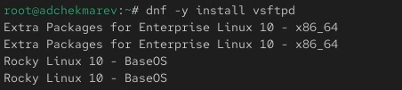

Запускаем службу Very Secure FTP. Проверяем статус службы Very Secure FTP. Вывод команды показывает, что служба в настоящее время работает, но не будет активирована при перезапуске операционной системы 

```
systemctl start vsftpd
systemctl status vsftpd
```

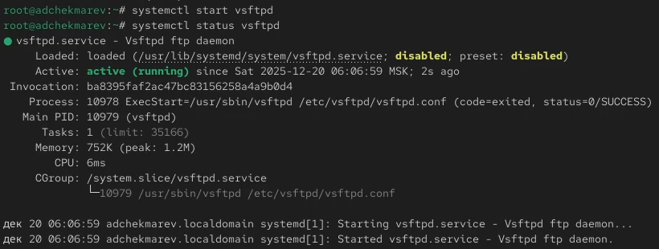

Добавляем службу Very Secure FTP в автозапуск при загрузке операционной системы, используя команду: **systemctl enable vsftpd**
Проверяем статус службы Very Secure FTP 

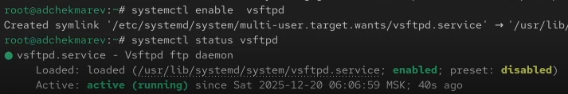

Удаляем службу из автозапуска, используя команду **systemctl disable vsftpd**, и снова проверяем её статус 

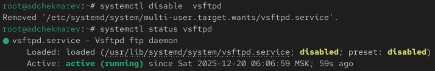

Выводим на экран символические ссылки, ответственные за запуск различных сервисов: **ls /etc/systemd/system/multi-user.target.wants**. После ввода этой команды отображается, что ссылки на vsftpd.service не существует 


Снова добавляем службу Very Secure FTP в автозапуск и опять выводим на экран символические ссылки, ответственные за запуск различных сервисов. На этот раз вывод команды показывает, что создана символическая ссылка для файла /usr/lib/systemd/system/vsftpd.service в каталоге /etc/systemd/system/multi-user.target.wants 

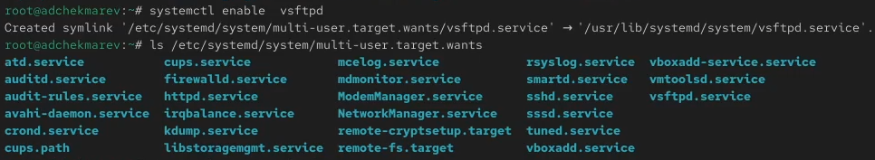

Опять проверяем статус службы Very Secure FTP. Теперь мы видим, что для файла юнита состояние изменено с disabled на enabled 


Выводим на экран список зависимостей юнита: **systemctl list-dependencies vsftpd**


Выводим на экран список юнитов, которые зависят от данного юнита: **systemctl list-dependencies vsftpd --reverse** 

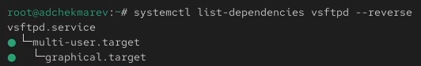

## Конфликты юнитов

Устанавливаем iptables: **dnf -y install iptables\* **

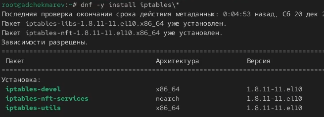

Далее проверяем статус firewalld и iptables 


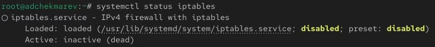

Далее пробуем запустить firewalld и iptables. При запуске одной службы мы видим, что вторая дезактивируется или не запускается

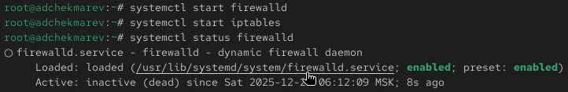

Вводим **cat /usr/lib/systemd/system/firewalld.service**.  

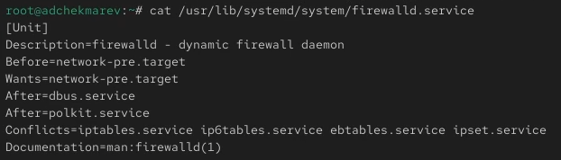

Описание настроек конфликтов: Conflicts=iptables.service ebtables.service ipset.service nftables.service. 
Этот параметр задает службы, которые конфликтуют с firewalld. Это означает, что одновременно с firewalld не могут быть запущены службы iptables.service, ebtables.service, ipset.service и nftables.service. 


Вводим **cat /usr/lib/systemd/system/iptables.service**. 

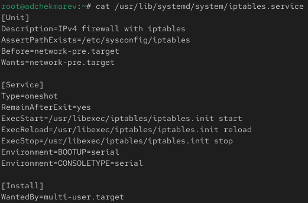

Описание настроек конфликтов: в данном юните параметр Conflicts отсутствует, что означает, что конфликтов с другими службами не указано. 
Хотя в юните iptables не указаны конфликты, мы знаем из предыдущей конфигурации firewalld, что firewalld указывает iptables как конфликтующую службу. 
Это означает, что если firewalld работает, то iptables не должен быть запущен одновременно, так как это может привести к конфликтам в управлении firewalld. 


Выгружаем службу iptables (на всякий случай, чтобы убедиться, что данная служба не загружена в систему): **systemctl stop iptables**. После загружаем службу firewalld 


Далее блокируем запуск iptables, введя: **systemctl mask iptables**. При этом будет создана символическая ссылка на /dev/null для /etc/systemd/system/iptables.service. Поскольку юнитфайлы в /etc/systemd имеют приоритет над файлами в /usr/lib/systemd, то это сделает невозможным случайный запуск сервиса iptables 


Пробуем запустить iptables м добавить iptables в автозапуск.
При попытке запустить iptables появляется сообщение об ошибке, указывающее, что служба замаскирована и по этой причине не может быть запущена. 
Сервис будет неактивен, а статус загрузки отобразится как замаскированный .

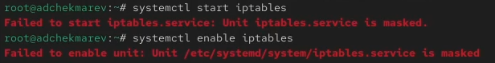

## Изолируемые цели

Переходим в каталог systemd и находим список всех целей, которые можно изолировать:

```
cd /usr/lib/systemd/system
grep Isolate *.target
```

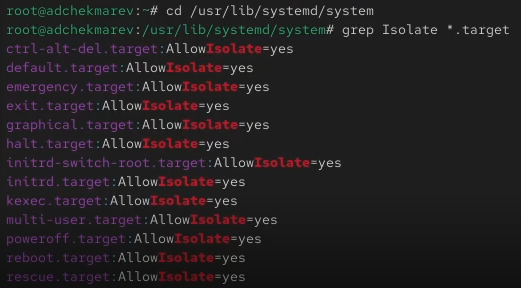

Далее переключаем операционную систему в режим восстановления: **systemctl isolate rescue.target** 
Переходим в режим root и перезапускаем операционную систему: **systemctl isolate reboot.target**
У меня не выводит консоль, я не знаю что делать, поэтому эти два пункта пропущены.

## Цель по умолчанию

Получаем права администратора. Далее выводим на экран цель, установленную по умолчанию: **systemctl get-default**. Сейчас графический режим 

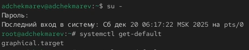

Для установки цели по умолчанию используется команда **systemctl set-default**. Запускаем по умолчанию текстовый режим введя команду **systemctl set-default multi-user.target** и перезагружаем систему командой **reboot** 


Система загрузилась в текстовом режиме. Далее получаем полномочия пользователя root и запускаем по умолчанию графический режим введя команду **systemctl set-default graphical.target**. После снова перезагружаем систему командой **reboot** 

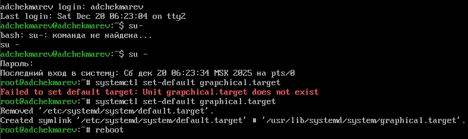

Система загрузилась в графическом режиме.

## Контрольные вопросы

1. Что такое юнит (unit)? Приведите примеры.

Юнит (или unit) в контексте систем управления, таких как systemd, — это абстрактное представление ресурса или сервиса, которым управляет система. Каждый юнит описывает один ресурс и содержит метаданные и инструкции о том, как управлять этим ресурсом.

Основные типы юнитов:

* Service Unit (.service):
  + Описывает службы или демоны, которые должны быть запущены в системе.
  + Пример: httpd.service для Apache HTTP Server.
* Socket Unit (.socket):
  + Управляет сокетами, которые могут активировать службы при получении соединений.
  + Пример: cups.socket для печатного сервиса CUPS.
* Target Unit (.target):
  + Группирует другие юниты и позволяет управлять целыми наборами.
  + Пример: multi-user.target, который аналогичен режиму "консоль" в других системах.
* Device Unit (.device):
  + Представляет физические или виртуальные устройства в системе.
  + Пример: dev-sda1.device для дискового раздела /dev/sda1.
* Mount Unit (.mount):
  + Описывает точки монтирования файловых систем..
  + Пример: mnt-data.mount для монтирования файловой системы в /mnt/data.
  
2. Какая команда позволяет вам убедиться, что цель больше не входит в список автоматического запуска при загрузке системы?

**systemctl is-enabled <имя_юнита>** (пример: systemctl is-enabled vsftpd.target) 

3. Какую команду вы должны использовать для отображения всех сервисных юнитов, которые в настоящее время загружены?

**systemctl list-units --type=srvice**

4. Как создать потребность (wants) в сервисе?

Нужно внести всю необходимую информацию в переменную Wants, которая находится в файле имя_сервиса.service

5. Как переключить текущее состояние на цель восстановления (rescue target)?

**systemctl set-default rescue.target**

6. Поясните причину получения сообщения о том, что цель не может быть изолирована.

Изолируя цель, мы запускаем эту цель со всеми её зависимостями. Не все цели могут быть изолированы (в случае, если цель является неотъемлемой частью system)

7. Вы хотите отключить службу systemd, но, прежде чем сделать это, вы хотите узнать, какие другие юниты зависят от этой службы. Какую команду вы бы использовали?

**systemctl list-dependencies <имя_юнита> --reverse** (пример: systemctl list-dependencies firewalld.service --reverse)


## Вывод:

В ходе работы приобретены умения по работе с управлением системными службами операционной системы посредством systemd


