---
## Front matter
lang: ru-RU
title: Лабораторная работа №6
subtitle: Управление процессами
author:
  - Чекмарев Александр Дмитриевич | Группа НПИбд-03-24
institute:
  - Российский университет дружбы народов, Москва, Россия
date: 10 октября 2025

## i18n babel
babel-lang: russian
babel-otherlangs: english

## Formatting pdf
toc: false
toc-title: Содержание
slide_level: 2
aspectratio: 169
section-titles: true
theme: warsaw

## Fonts
mainfont: Liberation Serif
romanfont: Liberation Serif
sansfont: Liberation Sans
monofont: Liberation Mono
mainfontoptions: Ligatures=TeX
romanfontoptions: Ligatures=TeX
sansfontoptions: Ligatures=TeX,Scale=MatchLowercase
monofontoptions: Scale=MatchLowercase,Scale=0.9
---

# Информация

## Докладчик

:::::::::::::: {.columns align=center}
::: {.column width="70%"}

  * Чекмарев Александр Дмитриевич
  * Группа НПИбд-03-24
  * Российский университет дружбы народов
  * <https://github.com/nenokixd?tab=repositories>

:::
::: {.column width="30%"}

:::
::::::::::::::

# Вводная часть

## Объект и предмет исследования

- Работа с процессами Linux Rocky

## Цель работы

- Получить навыки управления процессами операционной системы Linux Rocky

# Ход лаборатороной работы

## Создание заданий и их остановка

- Зайдем в режим root. Введем следующие команды для создания заданий

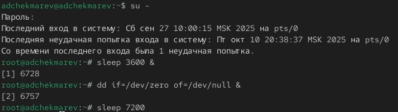{#fig:001 width=60%}

- Поскольку мы запустили последнюю команду без & после неё, у нас есть 2 часа, прежде чем мы снова получим контроль над оболочкой. 
- Нажмем Ctrl + z , чтобы остановить процесс.

{#fig:001 width=50%}

## Просмотр заданий

- С помощью команды jobs мы увидим три задания, которые мы только что запустили
- Первые два имеют состояние Running, а последнее задание в настоящее время находится в состоянии Stopped.

{#fig:001 width=65%} 

## Переход задания в фоновый режим

- Для продолжения выполнения задания 3 в фоновом режиме введем **bg 3**
- С помощью команды jobs посмотрим изменения в статусе заданий

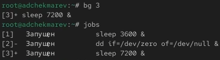{#fig:001 width=65%}

## Переход задания на переднйи план

- Для перемещения задания 1 на передний план введем **fg 1**
- Нажмем Ctrl + C, чтобы отменить задание 1. С помощью команды jobs посмотрим изменения в статусе заданий.

{#fig:001 width=65%}

## Завершение оставшихся заданий

- Проделаем то же самое для отмены заданий 2 и 3.

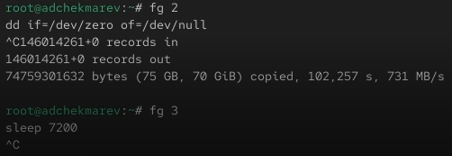{#fig:001 width=65%}

## Запуск задания в другом терминале

- Откроем второй терминал и под учётной записью пользователя введем в нём: **dd if=/dev/zero of=/dev/null &**
- Введем exit, чтобы закрыть второй терминал.

{#fig:001 width=75%}

## Просмотр задания запущеннего в изначальном терминале и его завершение

- На другом терминале под учётной записью пользователя запустим **top**
- Мы увидим, что задание dd всё ещё запущено. Используем k, чтобы завершить задание dd

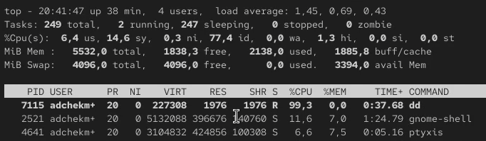{#fig:001 width=65%} 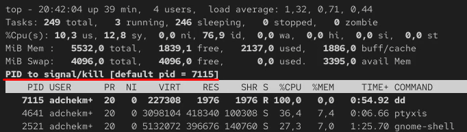{#fig:001 width=65%}

## Создание процессов

- Введем следующие команды для создания процессов

{#fig:001 width=70%}

## Просмотр запущенных процессов dd

- Введем **ps aux | grep dd**. 

{#fig:001 width=70%}

- Это показывает все строки, в которых есть буквы dd. Запущенные процессы dd идут последними.

## Изменение приоритета

- Используем PID одного из процессов dd, чтобы изменить приоритет. Используем **renice -n 5 <PID>**

{#fig:001 width=70%}

## Просмотр иерархии

- Введем **ps fax | grep -B5 dd**

{#fig:001 width=70%}

- Параметр -B5 показывает соответствующие запросу строки, включая пять строк до этого. Поскольку ps fax показывает иерархию отношений между процессами, мы также увидим оболочку, из которой были запущены все процессы dd, и её PID.

## Завершение процесса

- Найдем PID корневой оболочки, из которой были запущены процессы dd, и введем **kill -9 <PID>** 

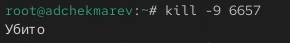{#fig:001 width=50%}

- Наша корневая оболочка закрылась, а вместе с ней и все процессы dd. Остановка родительского процесса — простой и удобный способ остановить все его дочерние процессы.

## Запуск фоновых заданий

- Запустим команду **dd if=/dev/zero of=/dev/null** трижды как фоновое задание.

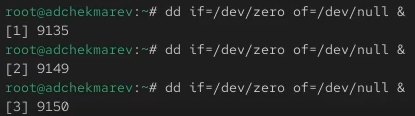{#fig:001 width=70%}

## Изменение приоритетов у процессов

- Увеличим приоритет одной из этих команд, используя значение приоритета −5.
- Изменим приоритет того же процесса ещё раз, но используем на этот раз значение -15.

{#fig:001 width=60%}

## Завершение всех процессов dd

- Завершим все процессы dd, которые мы запустили.

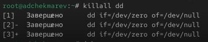{#fig:001 width=60%}

## Запуск процесса yes в фоновом режиме

- Запустим программу yes в фоновом режиме с подавлением потока вывода.

{#fig:001 width=70%}

## Запуск процесса yes на переднем плане, приоставление и завершение процесса

- Запустим программу yes на переднем плане с подавлением потока вывода. Приостановим выполнение программы. 
- Заново запустим программу yes с теми же параметрами, затем завершим её выполнение.

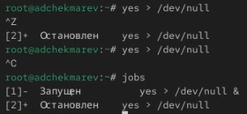{#fig:001 width=50%}

## Запуск программы yes на переднем плане без подавления потока вывода

- Запустим программу yes на переднем плане без подавления потока вывода. Приостановим выполнение программы. 
- Заново запустите программу yes с теми же параметрами, затем завершим её выполнение.

{#fig:001 width=30%} 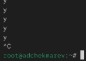{#fig:001 width=30%}

## Просмотр состояния заданий

- Проверим состояния заданий, воспользовавшись командой jobs.

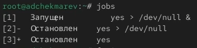{#fig:001 width=70%}

## Переход процесса на передний план и его остановка

- Переведем процесс, который у вас выполняется в фоновом режиме, на передний план, затем остановим его.

{#fig:001 width=70%}

## Переход процесса в фоновый режим и просмотр заданий

- Переведем любой наш процесс с подавлением потока вывода в фоновый режим.
- Проверим состояния заданий, воспользовавшись командой jobs. Обратим внимание, что процесс стал выполняющимся (Running) в фоновом режиме.

{#fig:001 width=70%}

## Запуск процесса через nohup

- Запустим процесс в фоновом режиме таким образом, чтобы он продолжил свою работу даже после отключения от терминала.

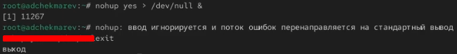{#fig:001 width=90%}

## Проверка работы процесса

- Закроем окно и заново запустим консоль. 
- Убедимся, что процесс продолжил свою работу с помощью top.

{#fig:001 width=80%}

## Запущенные процессы в ОС

- Получим информацию о запущенных в операционной системе процессах с помощью утилиты top.

{#fig:001 width=70%}

## Запуск трех процессов

- Запустим ещё три программы yes в фоновом режиме с подавлением потока вывода.

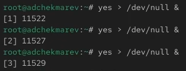{#fig:001 width=70%}

## Завершение процессов двумя способами

- Убъем два процесса: для одного используем его PID, а для другого — его идентификатор конкретного задания.
- Воспользуемся **fg 1** и прожмем ctrl+c. Во втором случае пропишем **kill -9 <PID>**

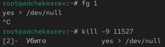{#fig:001 width=70%}

## Просмотр процессов yes и послание сигнала SIGHUP

- Попробуем послать сигнал 1 (SIGHUP) процессу, запущенному с помощью nohup, и обычному процессу.
- Перед этим проверим <PID> нужных нам процессов yes. 

{#fig:001 width=70%}

## Запуск процессов yes в фоновом режиме и их завершение

- Запустим ещё несколько программ yes в фоновом режиме с подавлением потока вывода.
- Завершим их работу одновременно, используя команду killall.

{#fig:001 width=60%}

## Запуск процесса yes в фоновом режиме и процесса yes через утилиту nice

- Запустим программу yes в фоновом режиме с подавлением потока вывода. 
- Используя утилиту nice, запустим программу yes с теми же параметрами и с приоритетом, большим на 5. 

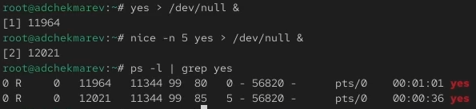{#fig:001 width=70%}

## Изменение приоритета у процесса yes и просмотр изменений

- Используя утилиту renice, изменим приоритет у одного из потоков yes таким образом, чтобы у обоих потоков приоритеты были равны.

{#fig:001 width=75%}

## Вывод:

В ходе работы приобретены навыки работы с процессами/заданиями в операционной системе Linux Rocky
