---
# Preamble

## Author
author:
  name: Чекмарев Александр Дмитриевич | группа НПИбд 03-24
  affiliation:
    - name: Российский университет дружбы народов
      country: Российская Федерация
   
## Title
title: "Лабораторная работа №6"
subtitle: "Управление процессами"
license: "CC BY"
## Generic options
lang: ru-RU
number-sections: true
toc: true
toc-title: "Содержание"
toc-depth: 2
## Crossref customization
crossref:
  lof-title: "Список иллюстраций"
  lot-title: "Список таблиц"
  lol-title: "Листинги"
## Bibliography
bibliography:
  - bib/cite.bib
csl: _resources/csl/gost-r-7-0-5-2008-numeric.csl
## Formats
format:
### Pdf output format
  pdf:
    toc: true
    number-sections: true
    colorlinks: false
    toc-depth: 2
    lof: true # List of figures
    lot: true # List of tables
#### Document
    documentclass: scrreprt
    papersize: a4
    fontsize: 12pt
    linestretch: 1.5
#### Language
    babel-lang: russian
    babel-otherlangs: english
#### Biblatex
    cite-method: biblatex
    biblio-style: gost-numeric
    biblatexoptions:
      - backend=biber
      - langhook=extras
      - autolang=other*
#### Misc options
    csquotes: true
    indent: true
    header-includes: |
      \usepackage{indentfirst}
      \usepackage{float}
      \floatplacement{figure}{H}
      \usepackage[math,RM={Scale=0.94},SS={Scale=0.94},SScon={Scale=0.94},TT={Scale=MatchLowercase,FakeStretch=0.9},DefaultFeatures={Ligatures=Common}]{plex-otf}
### Docx output format
  docx:
    toc: true
    number-sections: true
    toc-depth: 2
---

# Цель работы

Получить навыки управления процессами операционной системы.

# Выполнение лабораторной работы

## Управление заданиями

Получим полномочия администратора и введем следующие команды:

```
sleep 3600 &
dd if=/dev/zero of=/dev/null &
sleep 7200
```


Поскольку мы запустили последнюю команду без & после неё, у нас есть 2 часа, прежде чем мы снова получим контроль над оболочкой. 
Нажмем Ctrl + z , чтобы остановить процесс.

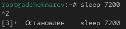

Введем **jobs**

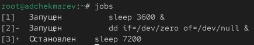

Мы увидим три задания, которые мы только что запустили. Первые два имеют состояние Running, а последнее задание в настоящее время находится в состоянии Stopped.


Для продолжения выполнения задания 3 в фоновом режиме введем **bg 3**
С помощью команды jobs посмотрим изменения в статусе заданий


Для перемещения задания 1 на передний план введем **fg 1**
Нажмем Ctrl + c , чтобы отменить задание 1. С помощью команды jobs посмотрим изменения в статусе заданий.

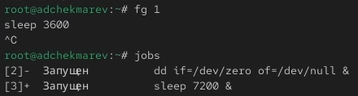

Проделаем то же самое для отмены заданий 2 и 3.


Откроем второй терминал и под учётной записью пользователя введем в нём: **dd if=/dev/zero of=/dev/null &**
Введем exit, чтобы закрыть второй терминал.

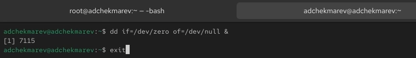

На другом терминале под учётной записью пользователя запустим **top**
Мы увидим, что задание dd всё ещё запущено. Для выхода из top используем q.


Вновь запустим top и в нём используем k, чтобы убить задание dd. После этого выйдем из top.


## Управление процессами

Получим полномочия администратора м введем следующие команды:

```
dd if=/dev/zero of=/dev/null &
dd if=/dev/zero of=/dev/null &
dd if=/dev/zero of=/dev/null &
```

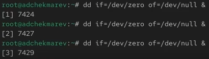

Введем **ps aux | grep dd**

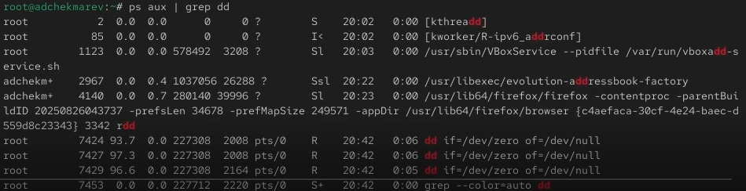

Это показывает все строки, в которых есть буквы dd. Запущенные процессы dd идут последними.

Используем PID одного из процессов dd, чтобы изменить приоритет. Используем **renice -n 5 \<PID\>**

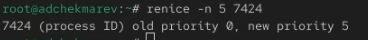

Введем **ps fax | grep -B5 dd**

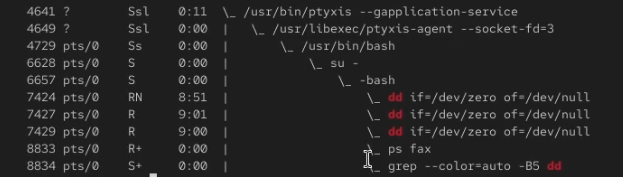

Параметр -B5 показывает соответствующие запросу строки, включая пять строк до этого. Поскольку ps fax показывает иерархию отношений между процессами, мы также увидим оболочку, из которой были запущены все процессы dd, и её PID.

Найдем PID корневой оболочки, из которой были запущены процессы dd, и введем **kill -9 \<PID\>** (заменив \<PID\> на значение PID оболочки). 


Мы увидим, что наша корневая оболочка закрылась, а вместе с ней и все процессы dd. Остановка родительского процесса — простой и удобный способ остановить все его дочерние процессы.

# Самостоятельная работа

## Задание 1

Запустим команду **dd if=/dev/zero of=/dev/null** трижды как фоновое задание.


Увеличим приоритет одной из этих команд, используя значение приоритета −5.
Изменим приоритет того же процесса ещё раз, но используем на этот раз значение -15.

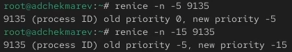

Завершим все процессы dd, которые мы запустили.


## Задание 2

Запустим программу yes в фоновом режиме с подавлением потока вывода.
Воспользуемся командой **yes > /dev/null &**

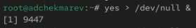

Запустим программу yes на переднем плане с подавлением потока вывода. Приостановим выполнение программы. Заново запустим программу yes с теми же параметрами, затем завершим её выполнение.

Воспользуемся командой **yes > /dev/null**
Приостановим процесс с помощью ctrl+z, завершим соответственно с помощью ctrl+c


Запустим программу yes на переднем плане без подавления потока вывода. Приостановим выполнение программы. Заново запустите программу yes с теми же параметрами, затем завершим её выполнение.

Введем **yes**

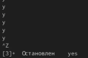


Проверим состояния заданий, воспользовавшись командой jobs.


Переведем процесс, который у вас выполняется в фоновом режиме, на передний план, затем остановим его.

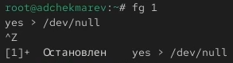

Переведем любой наш процесс с подавлением потока вывода в фоновый режим.
Проверим состояния заданий, воспользовавшись командой jobs. Обратим внимание, что процесс стал выполняющимся (Running) в фоновом режиме.

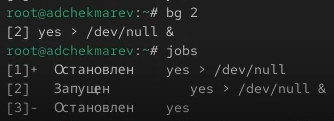

Запустим процесс в фоновом режиме таким образом, чтобы он продолжил свою работу даже после отключения от терминала.

Воспльзуемся командой **nohup yes > /dev/null &**


Закроем окно и заново запустим консоль. Убедимся, что процесс продолжил свою работу с помощью top.

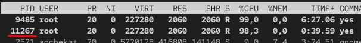

Получим информацию о запущенных в операционной системе процессах с помощью утилиты top.

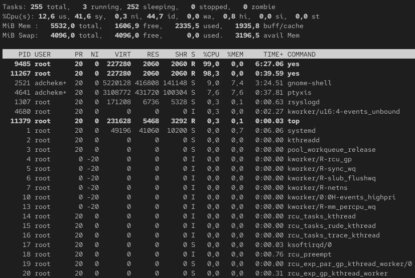

Запустим ещё три программы yes в фоновом режиме с подавлением потока вывода.
Выполним команду **yes > /dev/null** трижды 


Убъем два процесса: для одного используем его PID, а для другого — его идентификатор конкретного задания.
Воспользуемся **fg 1** и прожмем ctrl+c. Во втором случае пропишем **kill -9 \<PID\>**


Попробуем послать сигнал 1 (SIGHUP) процессу, запущенному с помощью nohup, и обычному процессу.

Узнаем/Проверим \<PID\> нужных нам процессов yes с помощью **ps aux | grep yes**
Пропишем **kill -1 \<PID\>** 

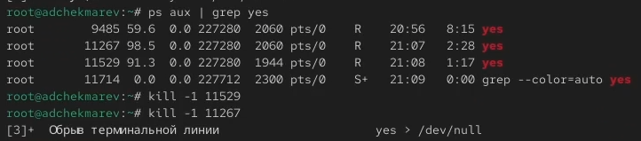

Запустим ещё несколько программ yes в фоновом режиме с подавлением потока вывода.
Завершим их работу одновременно, используя команду killall.

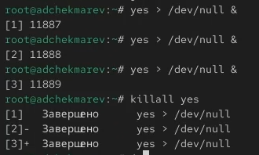

Запустим программу yes в фоновом режиме с подавлением потока вывода. Используя утилиту nice, запустим программу yes с теми же параметрами и с приоритетом, большим на 5. 
Для использования утилиты nice, пропишем данную команду **nice -n 5 yes > /dev/null &**. Просмотрим процессы yes


Используя утилиту renice, изменим приоритет у одного из потоков yes таким образом, чтобы у обоих потоков приоритеты были равны.
Воспользуемся командой **renice -n 5 \<PID\>**

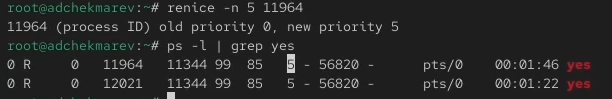

# Контрольные вопросы

1. Какая команда даёт обзор всех текущих заданий оболочки?

Команда **jobs**

2. Как остановить текущее задание оболочки, чтобы продолжить его выполнение в фоновом режиме?

Сначала приостановить текущее задание Ctrl + Z, затем перевести его в фоновый режим **bg** 


3. Какую комбинацию клавиш можно использовать для отмены текущего задания оболочки?

Комбинацию Ctrl + C

4. Необходимо отменить одно из начатых заданий. Доступ к оболочке, в которой в данный момент работает пользователь, невозможен. Что можно сделать, чтобы отменить задание?

Можно завершить процесс из другой оболочки (терминала) с помощью команды **ps -u <имя_пользователя>** или **pgrep <имя_команды>**
И затем **kill \<PID\>** или **kill -9 \<PID\>**

Либо через top с помощью k 

5. Какая команда используется для отображения отношений между родительскими и дочерними процессами?

**pstree**

Либо **ps fax | grep -B5 \<название\>**


6. Какая команда позволит изменить приоритет процесса с идентификатором 1234 на более высокий?

Чтобы повысить приоритет (уменьшить значение nice): **sudo renice -n -5 -p 1234**

7. В системе в настоящее время запущено 20 процессов dd. Как проще всего остановить их все сразу?

**ps aux | grep dd**
**sudo killall dd**

8. Какая команда позволяет остановить команду с именем mycommand?

pkill mycommand или killall mycommand

9. Какая команда используется в top, чтобы убить процесс?

Во время работы top нажать на k

10. Как запустить команду с достаточно высоким приоритетом, не рискуя, что не хватит ресурсов для других процессов?

nice -n 10 mycommand

# Выводы

Приобретены навыки управления процессами в операционной системы Linux Rocky.


# Список литературы{.unnumbered}

::: {#refs}
:::
