---
## Front matter
lang: ru-RU
title: Лабораторная работа №7
subtitle: Управление журналами событий в системе
author:
  - Чекмарев Александр Дмитриевич | Группа НПИбд-03-24
institute:
  - Российский университет дружбы народов, Москва, Россия
date: 20 Декабря 2025

## i18n babel
babel-lang: russian
babel-otherlangs: english

## Formatting pdf
toc: false
toc-title: Содержание
slide_level: 2
aspectratio: 169
section-titles: true
theme: warsaw

## Fonts
mainfont: Liberation Serif
romanfont: Liberation Serif
sansfont: Liberation Sans
monofont: Liberation Mono
mainfontoptions: Ligatures=TeX
romanfontoptions: Ligatures=TeX
sansfontoptions: Ligatures=TeX,Scale=MatchLowercase
monofontoptions: Scale=MatchLowercase,Scale=0.9
---

# Информация

## Докладчик

:::::::::::::: {.columns align=center}
::: {.column width="70%"}

  * Чекмарев Александр Дмитриевич
  * Группа НПИбд-03-24
  * Российский университет дружбы народов
  * <https://github.com/nenokixd?tab=repositories>

:::
::: {.column width="30%"}

:::
::::::::::::::

# Вводная часть

## Цель работы

- Получить навыки работы с журналами мониторинга различных событий в системе.

## Задание

1. Продемонстрировать навыки работы с журналом мониторинга событий в реальном времени 
2. Продемонстрировать навыки создания и настройки отдельного файла конфигурации мониторинга отслеживания событий веб-службы 
3. Продемонстрировать навыки работы с journalctl
4. Продемонстрировать навыки работы с journald 

# Выполнение лабораторной работы

## Мониторинг журнала системных событий в реальном времени

- Запускаем три вкладки терминала и в каждой из них получаем полномочия суперпользователя, используя **su -**

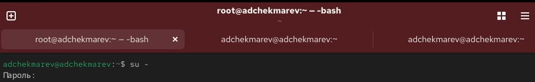{width=70%}

## Мониторинг журнала системных событий в реальном времени

- На второй вкладке терминала запустите мониторинг системных событий в реальном времени, с помощью **tail -f /var/log/messages**

{width=70%}

## Мониторинг журнала системных событий в реальном времени

- В третьей вкладке терминала возвращаемся к учётной записи своего пользователя (для этого нажимаем ctrl+d) и пробуем получить полномочия администратора, но на этот раз вводим неправильный пароль

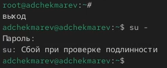{width=50%}

## Мониторинг журнала системных событий в реальном времени

- Во второй вкладке терминала с мониторингом событий после неудачной попытки получить права администратора появится сообщение «FAILED SU (to root) username ...»

{width=70%}

## Мониторинг журнала системных событий в реальном времени

- В третьей вкладке терминала из оболочки пользователя вводим **logger hello**

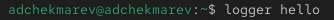{width=70%}

## Мониторинг журнала системных событий в реальном времени

- Во второй вкладке терминала с мониторингом событий мы увидим сообщение, которое до этого написали с помощью **logger**

{width=70%}

## Мониторинг журнала системных событий в реальном времени

- Во второй вкладке терминала с мониторингом останавливаем трассировку файла сообщений мониторинга реального времени, используя ctrl+c, а затем запускаем мониторинг сообщений безопасности (последние 20 строк соответствующего файла логов), с помощью *tail -n 20 /var/log/secure*. 
- Там мы увидим сообщения, которые ранее были зафиксированы во время ошибки авторизации при вводе команды su 

{width=70%}

## Изменение правил rsyslog.conf

- По умолчанию веб-служба не регистрирует свои сообщения через rsyslog, а пишет свой собственный журнал (в каталоге /var/log/httpd). 
- Настроим регистрацию сообщений веб-службы через syslog, создав правило, регистрирующее отладочные сообщения в отдельном лог-файле.
- В первой вкладке терминала установим Apache командой **dnf -y install httpd**

{width=70%}

## Изменение правил rsyslog.conf

- После окончания процесса установки запускаем веб-служб командами **systemctl start httpd** и **systemctl enable httpd**

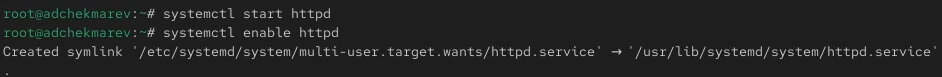{width=100%}

## Изменение правил rsyslog.conf

- Во второй вкладке терминала посмотрим журнал сообщений об ошибках веб-службы, с помощью *tail -f /var/log/httpd/error_log*. Для закрытия используем ctrl+c 

{width=80%}

## Изменение правил rsyslog.conf

- В третьей вкладке терминала получаем полномочия администратора и в файле конфигурации /etc/httpd/conf/httpd.conf в конце добавляем строку *ErrorLog syslog:local1*. 
- Добавление этой строки в конец файла конфигурации изменит способ регистрации ошибок веб-сервера. 
- Ошибки будут отправляться на систему журналирования через syslog в локальную категорию local1 

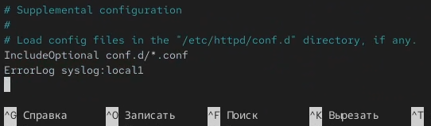{width=50%}

## Изменение правил rsyslog.conf

- Далее в каталоге /etc/rsyslog.d создаём файл мониторинга событий веб-службы 

{width=70%}

## Изменение правил rsyslog.conf

- Открыв его на редактирование, прописываем в нём строку local1.* -/var/log/httpd-error.log. 
- Эта строка позволит отправлять все сообщения, получаемые для объекта local1 (который теперь используется службой httpd), в файл /var/log/httpd-error.log 

{width=70%}

## Изменение правил rsyslog.conf

- Переходим в первую вкладку терминала и перезагружаем конфигурацию rsyslogd и веб-службу команжой *systemctl restart*. 
- Все сообщения об ошибках веб-службы теперь будут записаны в файл /var/log/httpd-error.log, что можно наблюдать или в режиме реального времени, используя команду tail с соответствующими параметрами, или непосредственно просматривая указанный файл

{width=70%}

## Изменение правил rsyslog.conf

- В третьей вкладке терминала создаём отдельный файл конфигурации для мониторинга отладочной информации 

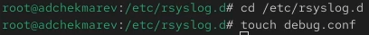{width=70%}

## Изменение правил rsyslog.conf

- В этом же терминале пишем команду **echo "*.debug /var/log/messages-debug" > /etc/rsyslog.d/debug.conf**

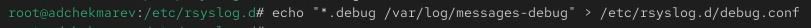{width=100%}

## Изменение правил rsyslog.conf

- В первой вкладке терминала снова перезапускаем rsyslogd 

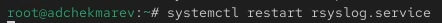{width=70%}

## Изменение правил rsyslog.conf

- Во второй вкладке терминала запускаем мониторинг отладочной информации с помощью **tail -f /var/log/messages-debug** 

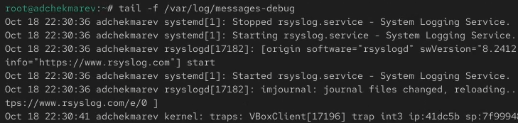{width=70%}

## Изменение правил rsyslog.conf

- В третьей вкладке терминала вводим **logger -p daemon.debug "Daemon Debug Message"** 

{width=100%}

## Изменение правил rsyslog.conf

- После этого мы увидим в терминале с мониторингом отладочной информации наше сообщение, которое мы создали с помощью **logger** 

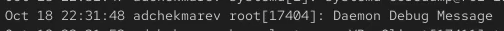{width=70%}

## Использование journalctl

- Во второй вкладке терминала посмотрим содержимое журнала с событиями с момента последнего запуска системы  с помощью **journalctl** 

{width=70%}

## Использование journalctl

- Далее посмотрим содержимоге журнала без использования пейджера с помощью **journalctl --no-pager**. 
- Это означает, что вывод соообщений будет отображатся сразу весь, без возможности прокручивания содержимого 

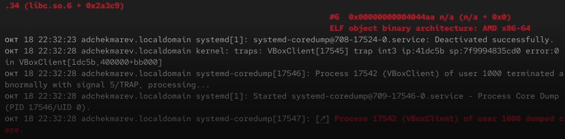{width=70%}

## Использование journalctl

- Далее посмотрим журнал в реальном времени командой **journalctl -f**. Для прерывания просмотра используем также ctrl+c 

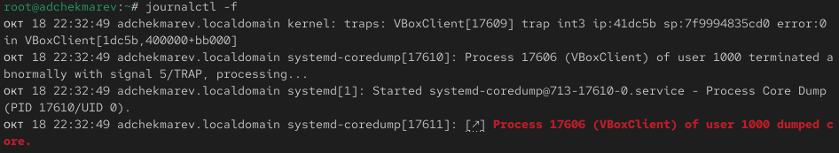{width=70%}

## Использование journalctl

- Для использования фильтрации просмотра конкретных параметров журнала вводим **journalctl** и дважды нажимаем на клавишу *Tab*

{width=70%}

## Использование journalctl

- Смотрим события UID0 командой **journalctl _UID=0**

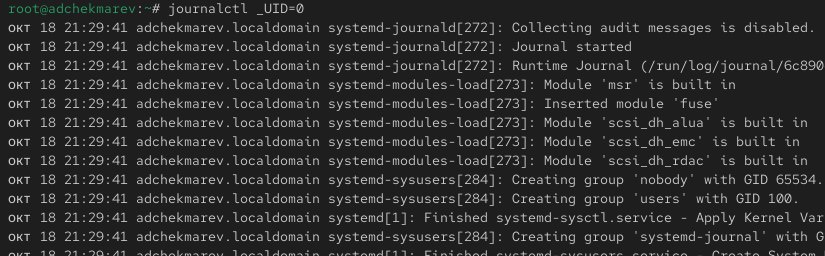{width=70%}

## Использование journalctl

- Для отображения последних 20 строк журнала вводим команду **journalctl -n 20**

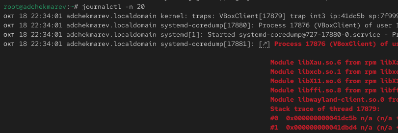{width=70%}

## Использование journalctl

- Для просмотра только сообщений об ошибках вводим **journalctl -p err** 

{width=70%}

## Использование journalctl

- Если мы хотим просмотреть сообщения журнала, записанные за определённый период времени, мы можем использовать параметры --since и --until. 
- Обе опции принимают параметр времени в формате YYYY-MM-DD hh:mm:ss. Кроме того, мы можем использовать yesterday, today и tomorrow в качестве параметров.

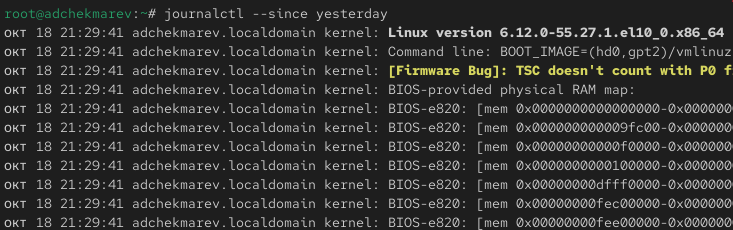{width=70%}

## Использование journalctl

- Далее просматриваем все сообщения с ошибкой приоритета, которые были зафиксированы со вчерашнего дня. Для этого используем команду *journalctl --since yesterday -p err*

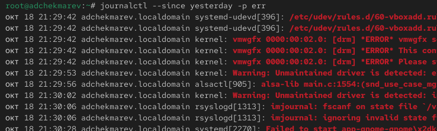{width=70%}

## Использование journalctl

- Посмотрим детальную информацию с помощью **journalctl -o verbose**

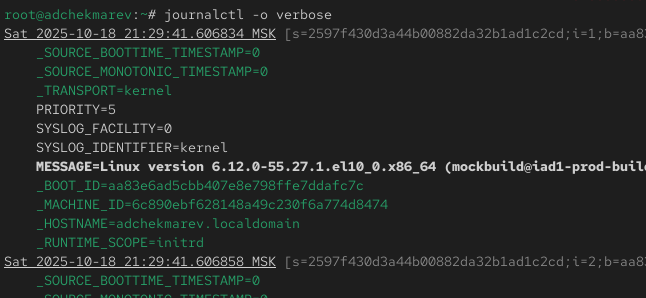{width=70%}

## Использование journalctl

- Для просмотра дополнительной информации о модуле sshd вводим **journalctl _SYSTEMD_UNIT=sshd.service**

{width=100%}

## Постоянный журнал journald

- Запускаем терминал и получаем полномочия администратора.
- Создаём каталог для хранения записей журнала **mkdir -p /var/log/journal**

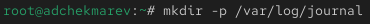{width=70%}

## Постоянный журнал journald

- Скорректируем права доступа для каталога /var/log/journal, чтобы journald смог записывать в него информацию. 
- Для этого введём команды **chown root:systemd-journal /var/log/journal** и **chmod 2755 /var/log/journal**

{width=70%}

## Постоянный журнал journald

- Для принятия изменений необходимо или перезагрузить систему (перезапустить службу systemd-journald недостаточно), или использовать команду **killall -USR1 systemd-journald**, что мы и делаем 

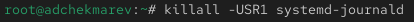{width=70%}

## Постоянный журнал journald

- Журнал systemd теперь постоянный. Теперь посмотрим сообщения журнала с момента последней перезагрузки с помошью команды **journalctl -b**

{width=70%}

# Подведение итогов

## Выводы

Мы получили навыки работы с журналами мониторинга различных событий в системе
