---
# Preamble

## Author
author:
  name: Чекмарев Александр Дмитриевич | группа НПИбд 03-24
  affiliation:
    - name: Российский университет дружбы народов
      country: Российская Федерация
   
## Title
title: "Лабораторная работа №7"
subtitle: "Управление журналами событий в системе"
license: "CC BY"
## Generic options
lang: ru-RU
number-sections: true
toc: true
toc-title: "Содержание"
toc-depth: 2
## Crossref customization
crossref:
  lof-title: "Список иллюстраций"
  lot-title: "Список таблиц"
  lol-title: "Листинги"
## Bibliography
bibliography:
  - bib/cite.bib
csl: _resources/csl/gost-r-7-0-5-2008-numeric.csl
## Formats
format:
### Pdf output format
  pdf:
    toc: true
    number-sections: true
    colorlinks: false
    toc-depth: 2
    lof: true # List of figures
    lot: true # List of tables
#### Document
    documentclass: scrreprt
    papersize: a4
    fontsize: 12pt
    linestretch: 1.5
#### Language
    babel-lang: russian
    babel-otherlangs: english
#### Biblatex
    cite-method: biblatex
    biblio-style: gost-numeric
    biblatexoptions:
      - backend=biber
      - langhook=extras
      - autolang=other*
#### Misc options
    csquotes: true
    indent: true
    header-includes: |
      \usepackage{indentfirst}
      \usepackage{float}
      \floatplacement{figure}{H}
      \usepackage[math,RM={Scale=0.94},SS={Scale=0.94},SScon={Scale=0.94},TT={Scale=MatchLowercase,FakeStretch=0.9},DefaultFeatures={Ligatures=Common}]{plex-otf}
### Docx output format
  docx:
    toc: true
    number-sections: true
    toc-depth: 2
---

# Цель работы

Получить навыки работы с журналами мониторинга различных событий в системе.

# Задание

1. Продемонстрировать навыки работы с журналом мониторинга событий в реальном времени 
2. Продемонстрировать навыки создания и настройки отдельного файла конфигурации мониторинга отслеживания событий веб-службы 
3. Продемонстрировать навыки работы с journalctl
4. Продемонстрировать навыки работы с journald 

# Выполнение лабораторной работы

## Мониторинг журнала системных событий в реальном времени

Запускаем три вкладки терминала и в каждой из них получаем полномочия суперпользователя, используя **su -**

На второй вкладке терминала запустите мониторинг системных событий в реальном времени, с помощью **tail -f /var/log/messages**

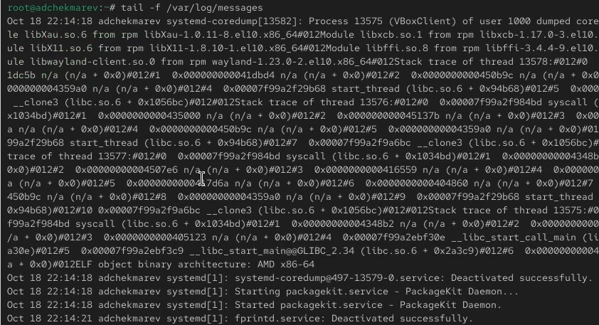

В третьей вкладке терминала возвращаемся к учётной записи своего пользователя (для этого нажимаем ctrl+d) и пробуем получить полномочия администратора, но на этот раз вводим неправильный пароль

Во второй вкладке терминала с мониторингом событий после неудачной попытки получить права администратора появится сообщение «FAILED SU (to root) username ...»

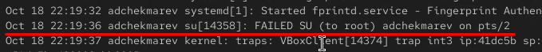

В третьей вкладке терминала из оболочки пользователя вводим **logger hello**

Во второй вкладке терминала с мониторингом событий мы увидим сообщение, которое до этого написали с помощью **logger**

Во второй вкладке терминала с мониторингом останавливаем трассировку файла сообщений мониторинга реального времени, используя ctrl+c, а затем запускаем мониторинг сообщений безопасности (последние 20 строк соответствующего файла логов), с помощью *tail -n 20 /var/log/secure*. Там мы увидим сообщения, которые ранее были зафиксированы во время ошибки авторизации при вводе команды su 

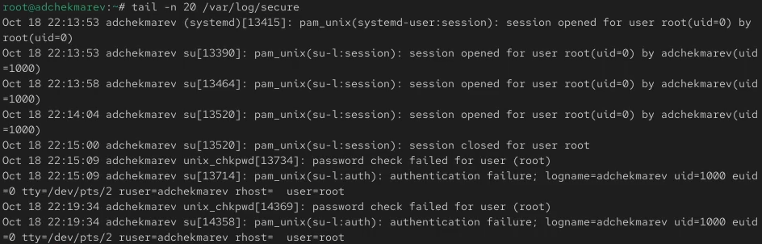

## Изменение правил rsyslog.conf

По умолчанию веб-служба не регистрирует свои сообщения через rsyslog, а пишет свой собственный журнал (в каталоге /var/log/httpd). 
Настроим регистрацию сообщений веб-службы через syslog, создав правило, регистрирующее отладочные сообщения в отдельном лог-файле.

В первой вкладке терминала установим Apache командой **dnf -y install httpd**

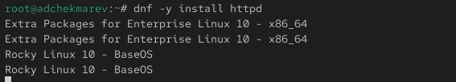

После окончания процесса установки запускаем веб-служб командами **systemctl start httpd** и **systemctl enable httpd**

Во второй вкладке терминала посмотрим журнал сообщений об ошибках веб-службы, с помощью *tail -f /var/log/httpd/error_log*. Для закрытия используем ctrl+c 

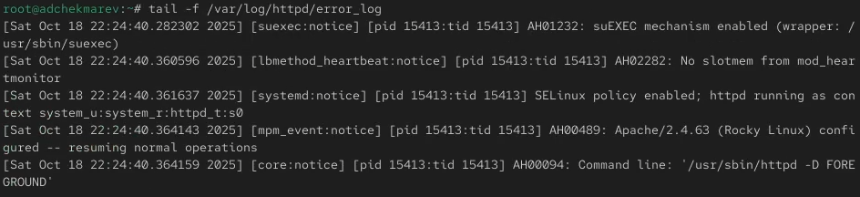

В третьей вкладке терминала получаем полномочия администратора и в файле конфигурации /etc/httpd/conf/httpd.conf в конце добавляем строку *ErrorLog syslog:local1*. 
Добавление этой строки в конец файла конфигурации изменит способ регистрации ошибок веб-сервера. 
Ошибки будут отправляться на систему журналирования через syslog в локальную категорию local1 

Далее в каталоге /etc/rsyslog.d создаём файл мониторинга событий веб-службы 

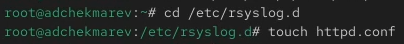

Открыв его на редактирование, прописываем в нём строку local1.* -/var/log/httpd-error.log. Эта строка позволит отправлять все сообщения, получаемые для объекта local1 (который теперь используется службой httpd), в файл /var/log/httpd-error.log 

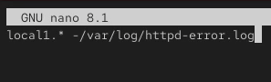

Переходим в первую вкладку терминала и перезагружаем конфигурацию rsyslogd и веб-службу команжой *systemctl restart*. Все сообщения об ошибках веб-службы теперь будут записаны в файл
/var/log/httpd-error.log, что можно наблюдать или в режиме реального времени, используя команду tail с соответствующими параметрами, или непосредственно просматривая указанный файл

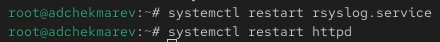

В третьей вкладке терминала создаём отдельный файл конфигурации для мониторинга отладочной информации 

В этом же терминале пишем команду **echo "*.debug /var/log/messages-debug" > /etc/rsyslog.d/debug.conf**

В первой вкладке терминала снова перезапускаем rsyslogd 

Во второй вкладке терминала запускаем мониторинг отладочной информации с помощью **tail -f /var/log/messages-debug** 

В третьей вкладке терминала вводим **logger -p daemon.debug "Daemon Debug Message"** 

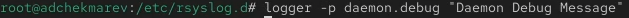
 
После этого мы увидим в терминале с мониторингом отладочной информации наше сообщение, которое мы создали с помощью **logger** 

## Использование journalctl

Во второй вкладке терминала посмотрим содержимое журнала с событиями с момента последнего запуска системы  с помощью **journalctl** 

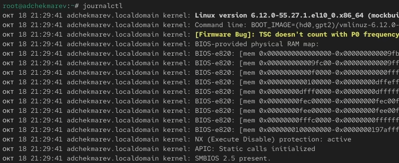

Далее посмотрим содержимоге журнала без использования пейджера с помощью **journalctl --no-pager**. Это означает, что вывод соообщений будет отображатся сразу весь, без возможности прокручивания содержимого 

Далее посмотрим журнал в реальном времени командой **journalctl -f**. Для прерывания просмотра используем также ctrl+c 

Для использования фильтрации просмотра конкретных параметров журнала вводим *journalctl* и дважды нажимаем на клавишу *Tab*

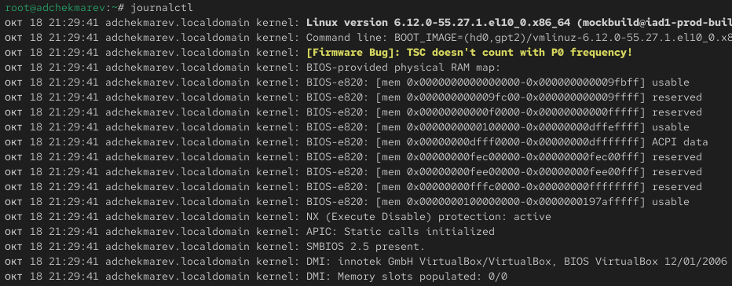

Смотрим события UID0 командой **journalctl _UID=0**

Для отображения последних 20 строк журнала вводим команду **journalctl -n 20**

Для просмотра только сообщений об ошибках вводим **journalctl -p err** 

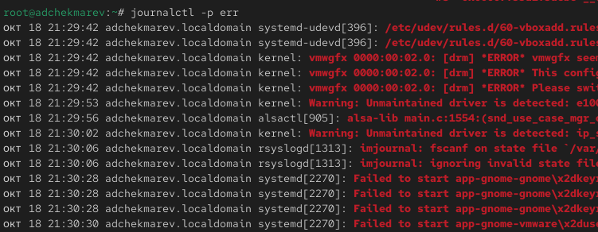

Если мы хотим просмотреть сообщения журнала, записанные за определённый период времени, мы можем использовать параметры --since и --until. Обе опции принимают параметр времени в формате YYYY-MM-DD hh:mm:ss. Кроме того, мы можем использовать yesterday, today и tomorrow в качестве параметров.

Для просмотра всех сообщений со вчерашнего дня вводим **journalctl --since yesterday**

Далее просматриваем все сообщения с ошибкой приоритета, которые были зафиксированы со вчерашнего дня. Для этого используем команду *journalctl --since yesterday -p err*

Посмотрим детальную информацию с помощью **journalctl -o verbose**

Для просмотра дополнительной информации о модуле sshd вводим **journalctl _SYSTEMD_UNIT=sshd.service**

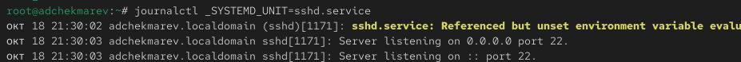

## Постоянный журнал journald

Запускаем терминал и получаем полномочия администратора.
Создаём каталог для хранения записей журнала **mkdir -p /var/log/journal**

Скорректируем права доступа для каталога /var/log/journal, чтобы journald смог записывать в него информацию. Для этого введём команды **chown root:systemd-journal /var/log/journal** и **chmod 2755 /var/log/journal**

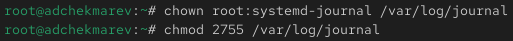

Для принятия изменений необходимо или перезагрузить систему (перезапустить службу systemd-journald недостаточно), или использовать команду **killall -USR1 systemd-journald**, что мы и делаем 

Журнал systemd теперь постоянный. Теперь посмотрим сообщения журнала с момента последней перезагрузки с помошью команды **journalctl -b**

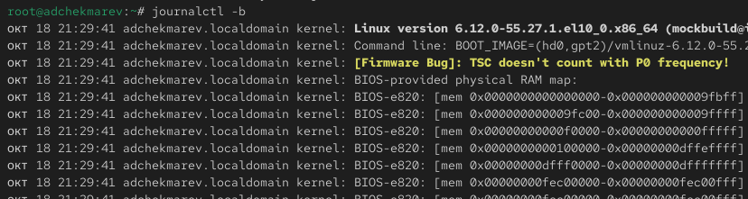

# Контрольные вопросы

1. Какой файл используется для настройки rsyslogd?

/etc/rsyslog.conf 

2. В каком файле журнала rsyslogd содержатся сообщения, связанные с аутентификацией?

/var/log/secure 

3. Если вы ничего не настроите, то сколько времени потребуется для ротации файлов журналов?

Неделя

4. Какую строку следует добавить в конфигурацию для записи всех сообщений с приоритетом info в файл /var/log/messages.info?

info.* -/var/log/messages.info

5. Какая команда позволяет вам видеть сообщения журнала в режиме реального времени?

tail -f /var/log/messages 

6. Какая команда позволяет вам видеть все сообщения журнала, которые были написаны для PID 1 между 9:00 и 15:00?

journalctl _PID=1 -since “2024-10-16 09:00:00” –until “2024-10-16 15:00:00”

7. Какая команда позволяет вам видеть сообщения journald после последней перезагрузки системы?

journalctl -b 

8. Какая процедура позволяет сделать журнал journald постоянным?

- запустить терминал и получить права пользователя root
- создать каталог для хранения записей журнала: *mkdir -p /var/log/journal* 
- скорректировать права доступа для каталога /var/log/journal, чтобы journald смог записывать в него информацию: *chown root:systemd-journal /var/log/journal* и *chmod 2755 /var/log/journal* 
- для принятия изменений используем команду *killall -USR1 systemd-journald* 

# Выводы

В ходе выполнения лабораторной работы мы получили навыки работы с журналами мониторинга различных событий в системе

# Список литературы{.unnumbered}

::: {#refs}
:::
