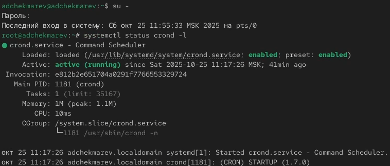
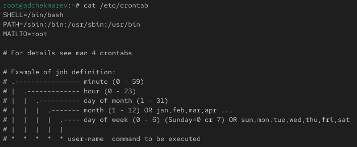
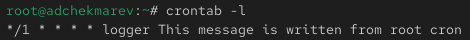
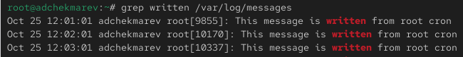
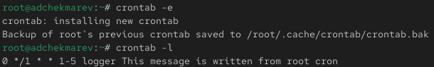
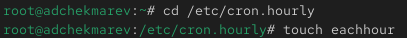
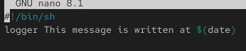
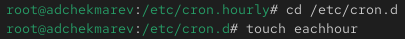
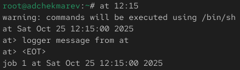

---
## Front matter
lang: ru-RU
title: Лабораторная работа №8
subtitle: Планировщики событий
author:
  - Чекмарев Александр Дмитриевич | Группа НПИбд-03-24
institute:
  - Российский университет дружбы народов, Москва, Россия
date: 25 октября 2025

## i18n babel
babel-lang: russian
babel-otherlangs: english

## Formatting pdf
toc: false
toc-title: Содержание
slide_level: 2
aspectratio: 169
section-titles: true
theme: warsaw

## Fonts
mainfont: Liberation Serif
romanfont: Liberation Serif
sansfont: Liberation Sans
monofont: Liberation Mono
mainfontoptions: Ligatures=TeX
romanfontoptions: Ligatures=TeX
sansfontoptions: Ligatures=TeX,Scale=MatchLowercase
monofontoptions: Scale=MatchLowercase,Scale=0.9
---

# Информация

## Докладчик

:::::::::::::: {.columns align=center}
::: {.column width="70%"}

  * Чекмарев Александр Дмитриевич
  * Группа НПИбд-03-24
  * Российский университет дружбы народов
  * <https://github.com/nenokixd?tab=repositories>

:::
::: {.column width="30%"}


:::
::::::::::::::

# Вводная часть

## Цель работы

Получение навыков работы с планировщиками событий cron и at.

## Задание

1. Выполнить задания по планированию задач с помощью crond
2. Выполнить задания по планированию задач с помощью atd 

# Выполнение лабораторной работы

## Планирование задач с помощью cron

- Запускаем терминала и получаем полномочия суперпользователя, используя *su -* 
- Смотрим статус демона crond с помощью *systemctl status crond -l*

{width=70%}

## Планирование задач с помощью cron

- Далее смотрим содержимое файла конфигурации /etc/crontab

{width=70%}

## Планирование задач с помощью cron

- Смотрим список заданий в расписании: *crontab -l*. Ничего не отобразится, так как расписание ещё не задано

{width=70%}

## Планирование задач с помощью cron

- Открываем файл расписания на редактирование: *crontab -e*
- Добавляем следующую строку в файл расписания ```*/1 * * * * logger This message is written from root cron```

{width=70%}

- Посмотрим список заданий в расписании с помощью **crontab -**

{width=70%}

## Планирование задач с помощью cron

- Не выключая систему, через некоторое время (2–3 минуты) посмотрим журнал системных событий: *grep written /var/log/messages*. 
- Мы видим что каждую минуту выполнялась команда logger "This message is written from root cron.", которая каждую минуту записывала сообщение в системный журнал

{width=70%}

## Планирование задач с помощью cron

- Далее меняем запись в расписании crontab на следующую: ```0 */1 * * 1-5 logger This message is written from root cron```

{width=70%}

- Снова посмотрим список заданий в расписании

{width=70%}


## Планирование задач с помощью cron

- Преходим в каталог /etc/cron.hourly и создадим в нём файл сценария с именем eachhour 

{width=70%}

## Планирование задач с помощью cron

- Открываем файл eachhour для редактирования и прописываем в нём следующий скрипт (запись сообщения в системный журнал)

```
#!/bin/sh
logger This message is written at $(date)
```

{width=70%}

## Планирование задач с помощью cron

Делаем файл сценария eachhour исполняемым: *chmod +x eachhour* 

{width=70%}

## Планирование задач с помощью cron

Теперь переходим в каталог /etc/crond.d и создаём в нём файл с расписанием eachhour

{width=70%}

## Планирование задач с помощью cron

Открываем этот файл для редактирования и помещаем в него следующее содержимое: ```11 * * * * root logger This message is written from /etc/cron.d```

{width=70%}


## Планирование задач с помощью cron

- Не выключая систему, через некоторое время (2–3 часа) посмотрим журнал системных событий. 
- Мы видим что сообщение *This message is written from root cron* записывалось в журнал каждый час, а сообщение *This message is written from /etc/cron.d* записывалось в журнал каждую минуту с 11-ой по 12-ую каждого часа

{width=70%}

## Планирование заданий с помощью at

Проверяем, что служба atd загружена и включена:*systemctl status atd* 

{width=70%}

## Планирование заданий с помощью at

Задаём выполнение команды *logger message from at в 12:15*. Для этого вводим сначала *at 12:15*, а затем *logger message from at*.

{width=70%}

## Планирование заданий с помощью at

- Убедимся, что задание действительно запланировано с помощью *atq* 
- С помощью команды *grep 'from at' /var/log/messages* посмотрим, появилось ли соответствующее сообщение в лог-файле в указанное нами время 

{width=70%}

# Подведение итогов

## Выводы

В ходе выполнения лабораторной работы мы получили навыки работы с планировщиками событий cron и at.
