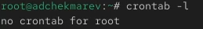
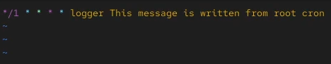
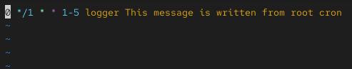
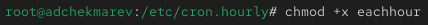
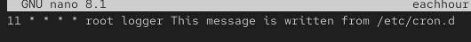
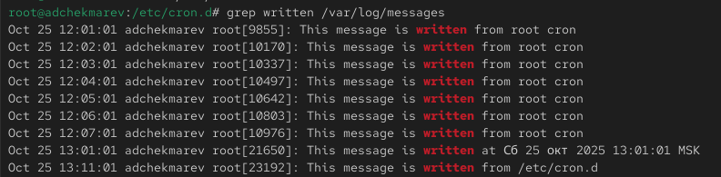
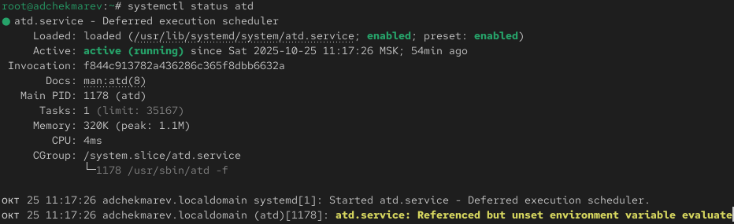
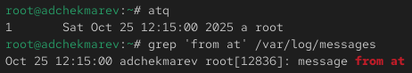

---
# Preamble

## Author
author:
  name: Чекмарев Александр Дмитриевич | группа НПИбд 03-24
  affiliation:
    - name: Российский университет дружбы народов
      country: Российская Федерация
   
## Title
title: "Лабораторная работа №8"
subtitle: "Планировщики событий"
license: "CC BY"
## Generic options
lang: ru-RU
number-sections: true
toc: true
toc-title: "Содержание"
toc-depth: 2
## Crossref customization
crossref:
  lof-title: "Список иллюстраций"
  lot-title: "Список таблиц"
  lol-title: "Листинги"
## Bibliography
bibliography:
  - bib/cite.bib
csl: _resources/csl/gost-r-7-0-5-2008-numeric.csl
## Formats
format:
### Pdf output format
  pdf:
    toc: true
    number-sections: true
    colorlinks: false
    toc-depth: 2
    lof: true # List of figures
    lot: true # List of tables
#### Document
    documentclass: scrreprt
    papersize: a4
    fontsize: 12pt
    linestretch: 1.5
#### Language
    babel-lang: russian
    babel-otherlangs: english
#### Biblatex
    cite-method: biblatex
    biblio-style: gost-numeric
    biblatexoptions:
      - backend=biber
      - langhook=extras
      - autolang=other*
#### Misc options
    csquotes: true
    indent: true
    header-includes: |
      \usepackage{indentfirst}
      \usepackage{float}
      \floatplacement{figure}{H}
      \usepackage[math,RM={Scale=0.94},SS={Scale=0.94},SScon={Scale=0.94},TT={Scale=MatchLowercase,FakeStretch=0.9},DefaultFeatures={Ligatures=Common}]{plex-otf}
### Docx output format
  docx:
    toc: true
    number-sections: true
    toc-depth: 2
---

# Цель работы

Получение навыков работы с планировщиками событий cron и at.

# Задание

1. Выполните задания по планированию задач с помощью crond 
2. Выполните задания по планированию задач с помощью atd 

# Выполнение лабораторной работы

## Планирование задач с помощью cron

Запускаем терминала и получаем полномочия суперпользователя. Посмотрим статус демона crond с помощью **systemctl status crond -l**


Посмотрим содержимое файла конфигурации /etc/crontab 


Посмотрим список заданий в расписании: **crontab -l**. Ничего не отобразится, так как расписание ещё не задано 



Открываем файл расписания на редактирование: **crontab -e**
Команда *crontab -e* запустит интерфейс редактора (по умолчанию используется vi). 
Добавляем следующую строку в файл расписания (запись сообщения в системный журнал), используя клавишу Ins для перехода в vi в режим ввода: 

```
*/1 * * * * logger This message is written from root cron 
```



Закрываем сеанс редактирования vi и сохраняем изменения, используя команду vi: **Esc :wq**


Пояснения к синтаксису записи в crontab:

```
1. */1: Это поле для минут. Значение */1 означает, что задача будет выполняться каждую минуту 
2. *: Поле для часов.  Значение * означает, что задача будет выполняться каждый час
3. *: Поле для дня месяца. * означает, что задача будет выполняться каждый день месяца
4. *: Поле для месяца. * означает, что задача будет выполняться каждый месяц
5. *: Поле для дня недели. * означает, что задача будет выполняться каждый день недели.
6. logger This message is written from root cron.:  Это команда, которую нужно выполнить.  logger  - стандартная команда в Unix/Linux системах, которая пишет сообщения в системный журнал
```

В итоге эта запись crontab означает, что  каждую минуту будет выполняться команда logger "This message is written from root cron.", которая запишет сообщение в системный журнал

Посмотрим список заданий в расписании с помощью **crontab -**. 
В расписании появилась запись о запланированном событии 


Не выключая систему, через некоторое время (2–3 минуты) посмотрим журнал системных событий: *grep written /var/log/messages*. 
Мы видим что каждую минуту выполнялась команда logger "This message is written from root cron.", которая каждую минуту записывала сообщение в системный журнал


Далее меняем запись в расписании crontab на следующую: 0 */1 * * 1-5 logger This message is written from root cron



Пояснения к синтаксису записи в crontab:

```
1. 0: Это поле для минут.  Значение 0 означает, что задача будет выполняться в начале каждого часа (в 00 минут)
2. */1: Поле для часов. Значение */1 означает, что задача будет выполняться  каждый час
3. *: Поле для дня месяца.  Значение * означает, что задача будет выполняться каждый день месяца
4. *: Поле для месяца.  Значение * означает, что задача будет выполняться каждый месяц
5. 1-5: Поле для дня недели. 1-5 означает, что задача будет выполняться с понедельника по пятницу (1 - понедельник, 7 - воскресенье)
6. logger This message is written from root cron.:  Это команда, которую нужно выполнить.  logger  - стандартная команда в Unix/Linux системах, которая пишет сообщения в системный журнал
```

В итоге эта запись crontab означает, что  в начале каждого часа (00 минут) с понедельника по пятницу  будет выполняться команда logger "This message is written from root cron.", которая запишет сообщение  в системный журнал.

Снова посмотрим список заданий в расписании 


Преходим в каталог /etc/cron.hourly и создадим в нём файл сценария с именем eachhour 


Открываем файл eachhour для редактирования и прописываем в нём следующий скрипт (запись сообщения в системный журнал): 

```
#!/bin/sh
logger This message is written at $(date)
```


Делаем файл сценария eachhour исполняемым: **chmod +x eachhour**



Теперь переходим в каталог /etc/crond.d и создаём в нём файл с расписанием eachhour 


Открываем этот файл для редактирования и помещаем в него следующее содержимое: 11 * * * * root logger This message is written from /etc/cron.d 



Пояснения к синтаксису записи:

```
1. 11:  Это поле для минут. Значение 11 означает, что задача будет выполняться в 11 минут каждого часа
2. *:  Поле для часов. Значение * означает, что задача будет выполняться каждый час
3. *:  Поле для дня месяца. Значение * означает, что задача будет выполняться каждый день месяца
4. *:  Поле для месяца. Значение * означает, что задача будет выполняться каждый месяц
5. *:  Поле для дня недели. Значение * означает, что задача будет выполняться каждый день недели
6. root:  Это поле для пользователя, от имени которого будет выполняться команда. В данном случае это суперпользователь root
7. logger This message is written from /etc/cron.d:  Это команда, которую нужно выполнить. logger - стандартная команда в Unix/Linux системах, которая пишет сообщения в системный журнал
```

В итоге эта запись crontab означает, что каждую минуту с 11-й по 12-ю минуту каждого часа будет выполняться команда logger "This message is written from /etc/cron.d" от имени суперпользователя root

Не выключая систему, через некоторое время (2–3 часа) посмотрим журнал системных событий. 
Мы видим что сообщение *This message is written from root cron* записывалось в журнал каждый час, а сообщение *This message is written from /etc/cron.d* записывалось в журнал каждую минуту с 11-ой по 12-ую каждого часа



## Планирование заданий с помощью at

Проверяем, что служба atd загружена и включена: **systemctl status atd**



Задаём выполнение команды **logger message from at в 12:15**. Для этого вводим сначала **at 12:15**, а затем **logger message from at**. После нажимаем ctrl+d чтобы закрыть оболочку


Убедимся, что задание действительно запланировано с помощью **atq** 
С помощью команды grep 'from at' /var/log/messages посмотрим, появилось ли соответствующее сообщение в лог-файле в указанное нами время 




# Контрольные вопросы

1. Как настроить задание cron, чтобы оно выполнялось раз в 2 недели?

```
00 00 1,15 * * logger task
```

2. Как настроить задание cron, чтобы оно выполнялось 1-го и 15-го числа каждого месяца в 2 часа ночи?

```
00 02 1,15 * * logger task
```

3. Как настроить задание cron, чтобы оно выполнялось каждые 2 минуты каждый день?

```
*/2 * * * * logger task
```

4. Как настроить задание cron, чтобы оно выполнялось 19 сентября ежегодно? 

```
* * 19 9 logger task
```

5. Как настроить задание cron, чтобы оно выполнялось каждый четверг сентября ежегодно? 

```
* * * * 4 logger task
```

6. Какая команда позволяет вам назначить задание cron для пользователя alice? Приведите подтверждающий пример. 

```
* * * * alice logger task
```

7. Как указать, что пользователю bob никогда не разрешено назначать задания через cron? Приведите подтверждающий пример.

записать его в /etc/cron.deny

8. Вам нужно убедиться, что задание выполняется каждый день, даже если сервер во время выполнения временно недоступен. Как это сделать?

Найти задание в логах grep cron /var/log/messages

9. Какая команда позволяет узнать, запланированы ли какие-либо задания на выполнение планировщиком atd? 

atq

# Выводы

В ходе выполнения лабораторной работы мы получили навыки работы с планировщиками событий cron и at.


# Список литературы{.unnumbered}

::: {#refs}
:::
