---
## Front matter
lang: ru-RU
title: Лабораторная работа №9
subtitle: Управление SELinux
author:
  - Чекмарев Александр Дмитриевич | Группа НПИбд-03-24
institute:
  - Российский университет дружбы народов, Москва, Россия
date: 29 Ноября 2025

## i18n babel
babel-lang: russian
babel-otherlangs: english

## Formatting pdf
toc: false
toc-title: Содержание
slide_level: 2
aspectratio: 169
section-titles: true
theme: warsaw

## Fonts
mainfont: Liberation Serif
romanfont: Liberation Serif
sansfont: Liberation Sans
monofont: Liberation Mono
mainfontoptions: Ligatures=TeX
romanfontoptions: Ligatures=TeX
sansfontoptions: Ligatures=TeX,Scale=MatchLowercase
monofontoptions: Scale=MatchLowercase,Scale=0.9
---

# Информация

## Докладчик

:::::::::::::: {.columns align=center}
::: {.column width="70%"}

  * Чекмарев Александр Дмитриевич
  * Группа НПИбд-03-24
  * Российский университет дружбы народов
  * <https://github.com/nenokixd?tab=repositories>

:::
::: {.column width="30%"}

:::
::::::::::::::

# Вводная часть

## Цель работы

Получить навыки работы с контекстом безопасности и политиками SELinux.

## Задание

1. Продемонстрируйте навыки по управлению режимами SELinux 
2. Продемонстрируйте навыки по восстановлению контекста безопасности SELinux 
3. Настройте контекст безопасности для нестандартного расположения файлов вебслужбы 
4. Продемонстрируйте навыки работы с переключателями SELinux 

# Выполнение лабораторной работы

##  Управление режимами SELinux

- Запускаем терминала и получаем полномочия суперпользователя.
- Посмотрим текущую информацию о состоянии SELinux, используя **sestatus -v**

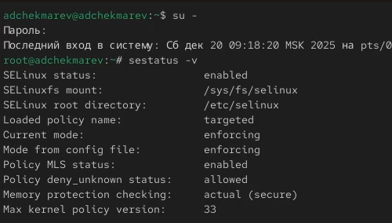{width=60%}

##  Управление режимами SELinux

- Посмотрим, в каком режиме работает SELinux: **getenforce**
- По умолчанию SELinux находится в режиме принудительного исполнения (Enforcing).
- Изменим режим работы SELinux на разрешающий (Permissive): **setenforce 0** и **getenforce**

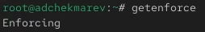{width=70%} 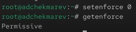{width=70%}

##  Управление режимами SELinux

- В файле /etc/sysconfig/selinux с помощью редактора устанавливаем параметр disabled: **SELINUX=disabled** 
- И перезагрузим систему

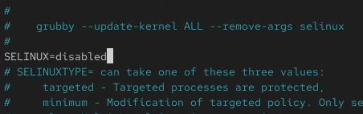{width=50%} {width=50%}

##  Управление режимами SELinux

- После перезагрузки запускаем терминал и получаем полномочия администратора. Посмотрим статус SELinux: **getenforce**
- Попробуем переключить режим работы SELinux: **setenforce 1**. Мы не сможем этого сделать, так как SELinux отключён

{width=70%} 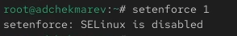{width=70%}

##  Управление режимами SELinux

- В файле /etc/sysconfig/selinux с помощью редактора устанавливаем параметр enforcing: **SELINUX=enforcing** 
- И перезагрузим систему

{width=70%} {width=70%}

- Во время загрузки системы мы, получили предупреждающее сообщение о необходимости восстановления меток SELinux, что может занять некоторое время, а также потребует дополнительной перезагрузки системы.

##  Управление режимами SELinux

- После перезагрузки в терминале с полномочиями администратора посмотрим текущую информацию о состоянии SELinux: **sestatus -v**
- Система работает в принудительном режиме (enforcing) использования SELinux 

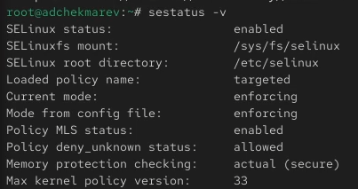{width=50%}

## Использование restorecon для восстановления контекста безопасности

- Посмотрим контекст безопасности файла /etc/hosts: **ls -Z /etc/hosts**.
- Мы увидим, что у файла есть метка контекста net_conf_t 
- Скопируем файл /etc/hosts в домашний каталог, с помощью **cp /etc/hosts ~/** 
- Проверяем контекст файла ~/hosts: **ls -Z ~/hosts**

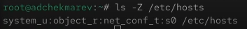{width=70%} {width=70%}

- Поскольку копирование считается созданием нового файла, то параметр контекста в файле ~/hosts, расположенном в домашнем каталоге, станет admin_home_t

## Использование restorecon для восстановления контекста безопасности

- Попытаемся перезаписать существующий файл hosts из домашнего каталога в каталог /etc: **mv ~/hosts /etc** 
- Проверим, что тип контекста по-прежнему установлен на admin_home_t: **ls -Z /etc/hosts** 

 

## Использование restorecon для восстановления контекста безопасности

- Исправим контекст безопасности: **restorecon -v /etc/hosts** 
- Опция -v покажет процесс изменения
- Убедимся, что тип контекста изменился 

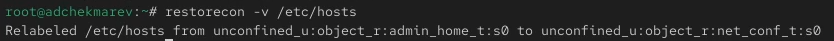 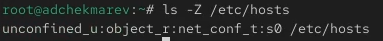

## Использование restorecon для восстановления контекста безопасности

- Для массового исправления контекста безопасности на файловой системе вводим **touch /.autorelabel** 
- Перезагружаем систему. Во время перезапуска нажимаем клавишу Esc, чтобы мы видели загрузочные сообщения. Мы можем увидеть, что файловая система автоматически перемаркирована

## Настройка контекста безопасности для нестандартного расположения файлов веб-сервера

- Устанавливаем необходимое программное обеспечение 

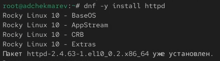{width=70%} {width=70%}

## Настройка контекста безопасности для нестандартного расположения файлов веб-сервера

- Создаём новое хранилище для файлов web-сервера
- Создадим файл index.html в каталоге с контентом веб-сервера и отредактируем его 
- Добавим в файл следующий текст: **Welcome to my web-server** 

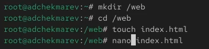 

## Настройка контекста безопасности для нестандартного расположения файлов веб-сервера

- В файле /etc/httpd/conf/httpd.conf закомментируем строку **DocumentRoot "/var/www/html"** и ниже добавим строку **DocumentRoot "/web"** 
- Затем в этом же файле закомментируем раздел и добавим следующий раздел, определяющий правила доступа: 

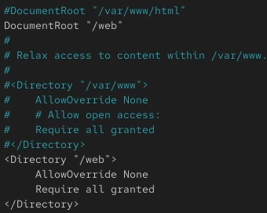{width=30%}

## Настройка контекста безопасности для нестандартного расположения файлов веб-сервера

- Запускаем веб-сервер и службу httpd 

## Настройка контекста безопасности для нестандартного расположения файлов веб-сервера

- В терминале под учётной записью нашего пользователя обращаемся к веб-серверу в текстовом браузере lynx: **lynx http://localhost ** 
- Мы увидим веб-страницу Red Hat по умолчанию, а не содержимое только что созданного файла index.html.
- В нижней части терминала с lynx указаны подсказки по навигации. Для выхода изlynx нажмем q.

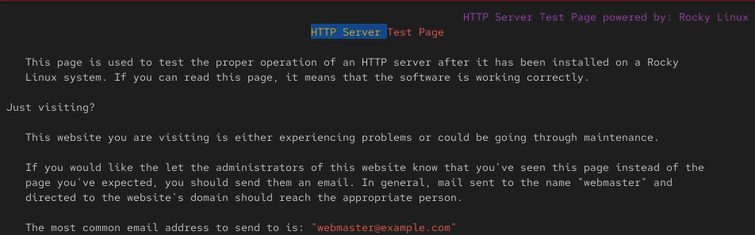

## Настройка контекста безопасности для нестандартного расположения файлов веб-сервера

- В терминале с полномочиями администратора применяем новую метку контекста к /web: "semanage fcontext -a -t httpd_sys_content_t "/web(/.*)?" "
- Восстановим контекст безопасности: *restorecon -R -v /web*

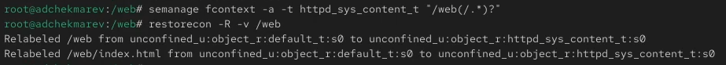

## Настройка контекста безопасности для нестандартного расположения файлов веб-сервера

- В терминале под учётной записью нашего пользователя снова обращаемся к веб-серверу: **lynx http://localhost **.  

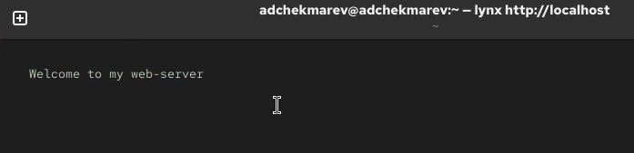

- Теперь мы получили доступ к своей пользовательской веб-странице. На экране есть запись «Welcome to my web-server»

## Работа с переключателями SELinux

- Посмотрим список переключателей SELinux для службы ftp: **getsebool -a | grep ftp**. 
- Мы увидим переключатель ftpd_anon_write с текущим значением off

{width=70%}

## Работа с переключателями SELinux

- Для службы ftpd_anon посмотрим список переключателей с пояснением, за что отвечает каждый переключатель, включён он или выключен: **semanage boolean -l | grep ftpd anon**

## Работа с переключателями SELinux

- Изменим текущее значение переключателя для службы ftpd_anon_write с off на on: **setsebool ftpd_anon_write on** 
- Повторно смотрим список переключателей SELinux для службы ftpd_anon_write: **getsebool ftpd_anon_write** 

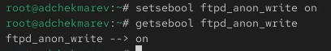

## Работа с переключателями SELinux

- Псмотрим список переключателей с пояснением: **semanage boolean -l | grep ftpd_anon**.
- Мы видим, что настройка времени выполнения включена, но постоянная настройка по-прежнему отключена 

## Работа с переключателями SELinux

- Изменим постоянное значение переключателя для службы ftpd_anon_write с off на on: **setsebool -P ftpd_anon_write on**
- Снова посмотрим список переключателей: **semanage boolean -l | grep ftpd_anon**

- Теперь постоянная настройка включена 

# Подведение итогов

## Выводы

В ходе выполнения лабораторной работы мы получили навыки и работы с контекстом безопасности и политиками SELinux
