---
# Preamble

## Author
author:
  name: Чекмарев Александр Дмитриевич | группа НПИбд 03-24
  affiliation:
    - name: Российский университет дружбы народов
      country: Российская Федерация
   
## Title
title: "Лабораторная работа №9"
subtitle: "Управление SELinux"
license: "CC BY"
## Generic options
lang: ru-RU
number-sections: true
toc: true
toc-title: "Содержание"
toc-depth: 2
## Crossref customization
crossref:
  lof-title: "Список иллюстраций"
  lot-title: "Список таблиц"
  lol-title: "Листинги"
## Bibliography
bibliography:
  - bib/cite.bib
csl: _resources/csl/gost-r-7-0-5-2008-numeric.csl
## Formats
format:
### Pdf output format
  pdf:
    toc: true
    number-sections: true
    colorlinks: false
    toc-depth: 2
    lof: true # List of figures
    lot: true # List of tables
#### Document
    documentclass: scrreprt
    papersize: a4
    fontsize: 12pt
    linestretch: 1.5
#### Language
    babel-lang: russian
    babel-otherlangs: english
#### Biblatex
    cite-method: biblatex
    biblio-style: gost-numeric
    biblatexoptions:
      - backend=biber
      - langhook=extras
      - autolang=other*
#### Misc options
    csquotes: true
    indent: true
    header-includes: |
      \usepackage{indentfirst}
      \usepackage{float}
      \floatplacement{figure}{H}
      \usepackage[math,RM={Scale=0.94},SS={Scale=0.94},SScon={Scale=0.94},TT={Scale=MatchLowercase,FakeStretch=0.9},DefaultFeatures={Ligatures=Common}]{plex-otf}
### Docx output format
  docx:
    toc: true
    number-sections: true
    toc-depth: 2
---

# Цель работы

Получить навыки работы с контекстом безопасности и политиками SELinux.

# Задание

1. Продемонстрируйте навыки по управлению режимами SELinux 
2. Продемонстрируйте навыки по восстановлению контекста безопасности SELinux 
3. Настройте контекст безопасности для нестандартного расположения файлов вебслужбы 
4. Продемонстрируйте навыки работы с переключателями SELinux 

# Выполнение лабораторной работы

##  Управление режимами SELinux

Запускаем терминала и получаем полномочия суперпользователя.
Посмотрим текущую информацию о состоянии SELinux, используя **sestatus -v**


**Основная информация о статусе SELinux:**

- **SELinux status:** enabled — SELinux включен в системе
- **SELinuxfs mount:** /sys/fs/selinux — путь, где монтируется файловая система SELinux
- **SELinux root directory:** /etc/selinux — корневой каталог, в котором хранятся конфигурационные файлы SELinux 
- **Loaded policy name:** targeted — в системе загружена политика targeted, которая защищает определенные сервисы 
- **Current mode:** enforcing — SELinux работает в режиме enforcing, то есть все запрещенные действия блокируются 
- **Mode from config file:** enforcing — конфигурационный файл настроен на режим enforcing
- **Policy MLS status:** enabled — включена поддержка многоуровневой безопасности (MLS)
- **Policy deny_unknown status:** allowed — неизвестные действия разрешены, но это обычно не рекомендуется 
- **Memory protection checking:** actual (secure) — используется актуальная защита памяти
- **Max kernel policy version:** 33 — максимальная версия политики, поддерживаемая ядром 

**Контексты процессов:**

- **Current context:** unconfined_u:unconfined_r:unconfined_t:s0-s0:c0.c1023 — текущий контекст пользователя, использующего терминал, показывает, что пользователь не ограничен политиками SELinux 
- **Init context:** system_u:system_r:init_t:s0 — контекст процесса инициализации (init), который запускается от имени system_u 
- **/usr/sbin/sshd:** system_u:system_r:sshd_t:s0-s0:c0.c1023 — контекст для демона sshd (Secure Shell Daemon), запущенного от имени system_u, чтобы ограничить его права в системе 

**Контексты файлов:**

Каждая строка в этом разделе показывает файлы и процессы с их соответствующими SELinux-контекстами

- **Controlling terminal:** unconfined_u:object_r:user_devpts_t:s0 — терминал, к которому подключен пользователь, в контексте user_devpts_t
- **/etc/passwd и /etc/shadow:** находятся в контексте passwd_file_t и shadow_t, что ограничивает доступ к этим файлам для повышения безопасности
- **/bin/bash:** контекст shell_exec_t, указывающий, что это исполняемый файл командной оболочки
- **/usr/sbin/sshd:** контекст sshd_exec_t, что позволяет SELinux определять, что этот файл — исполняемый файл SSH

Посмотрим, в каком режиме работает SELinux: **getenforce**


По умолчанию SELinux находится в режиме принудительного исполнения (Enforcing).

Изменим режим работы SELinux на разрешающий (Permissive): **setenforce 0** и **getenforce**


В файле /etc/sysconfig/selinux с помощью редактора устанавливаем параметр disabled: **SELINUX=disabled** 
И перезагрузим систему


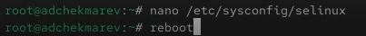

После перезагрузки запускаем терминал и получаем полномочия администратора. Посмотрим статус SELinux: **getenforce**

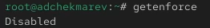

Мы увидем, что SELinux теперь отключён

Попробуем переключить режим работы SELinux: **setenforce 1**. Мы не сможем этого сделать, так как SELinux отключён


В файле /etc/sysconfig/selinux с помощью редактора устанавливаем параметр enforcing: **SELINUX=enforcing** 
И перезагрузим систему

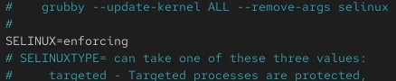

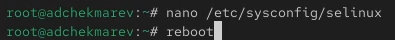

Во время загрузки системы мы, получили предупреждающее сообщение о необходимости восстановления меток SELinux, что может занять некоторое время, а также потребует дополнительной перезагрузки системы.

После перезагрузки в терминале с полномочиями администратора посмотрим текущую информацию о состоянии SELinux: **sestatus -v**


Система работает в принудительном режиме (enforcing) использования SELinux 

## Использование restorecon для восстановления контекста безопасности

Посмотрим контекст безопасности файла /etc/hosts: **ls -Z /etc/hosts**.


Мы увидим, что у файла есть метка контекста net_conf_t 

Скопируем файл /etc/hosts в домашний каталог, с помощью **cp /etc/hosts ~/** 
Проверяем контекст файла ~/hosts: **ls -Z ~/hosts**

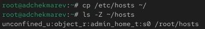

Поскольку копирование считается созданием нового файла, то параметр контекста в файле ~/hosts, расположенном в домашнем каталоге, станет admin_home_t

Попытаемся перезаписать существующий файл hosts из домашнего каталога в каталог /etc: **mv ~/hosts /etc** 

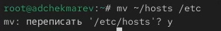

Проверим, что тип контекста по-прежнему установлен на admin_home_t: **ls -Z /etc/hosts** 

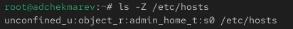

Исправим контекст безопасности: **restorecon -v /etc/hosts** 


Опция -v покажет процесс изменения

Убедимся, что тип контекста изменился 


Для массового исправления контекста безопасности на файловой системе вводим **touch /.autorelabel** 

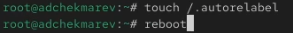

Перезагружаем систему. Во время перезапуска нажимаем клавишу Esc, чтобы мы видели загрузочные сообщения. Мы увидим, что файловая система автоматически перемаркирована


## Настройка контекста безопасности для нестандартного расположения файлов веб-сервера

Устанавливаем необходимое программное обеспечение 

```
dnf -y install httpd
dnf -y install lynx
```


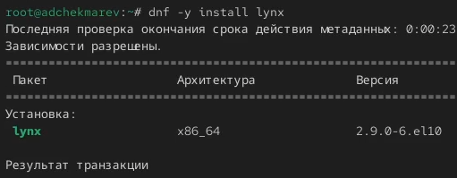

Создаём новое хранилище для файлов web-сервера
Создадим файл index.html в каталоге с контентом веб-сервера и отредактируем его 

```
mkdir /web
cd /web
touch index.html
```


Поместим в файл следующий текст: **Welcome to my web-server** 


В файле /etc/httpd/conf/httpd.conf закомментируем строку **DocumentRoot "/var/www/html"** и ниже добавим строку **DocumentRoot "/web"** 
Затем в этом же файле ниже закомментируем раздел

```
<Directory "/var/www">
  AllowOverride None
  Require all granted
</Directory>
```

и добавим следующий раздел, определяющий правила доступа: 

```
<Directory "/web">
  AllowOverride None
  Require all granted
</Directory>
```


Запускаем веб-сервер и службу httpd 

```
systemctl start httpd
systemctl enable httpd
```

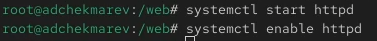

В терминале под учётной записью нашего пользователя обращаемся к веб-серверу в текстовом браузере lynx: **lynx http://localhost ** 


Мы увидим веб-страницу Red Hat по умолчанию, а не содержимое только что созданного файла index.html.
В нижней части терминала с lynx указаны подсказки по навигации. Для выхода изlynx нажмем q.

В терминале с полномочиями администратора применяем новую метку контекста к /web: **semanage fcontext -a -t httpd_sys_content_t "/web(/.*)?" **
Восстановим контекст безопасности: **restorecon -R -v /web** 


В терминале под учётной записью нашего пользователя снова обращаемся к веб-серверу: **lynx http://localhost **.  


Теперь мы получили доступ к своей пользовательской веб-странице. На экране есть запись «Welcome to my web-server»

## Работа с переключателями SELinux

Посмотрим список переключателей SELinux для службы ftp: **getsebool -a | grep ftp**. 

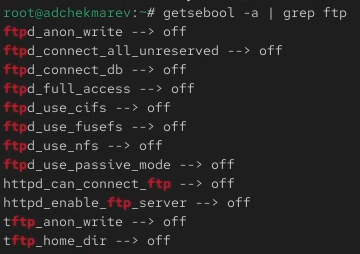

Мы увидим переключатель ftpd_anon_write с текущим значением off

Для службы ftpd_anon посмотрим список переключателей с пояснением, за что отвечает каждый переключатель, включён он или выключен: **semanage boolean -l | grep ftpd anon**

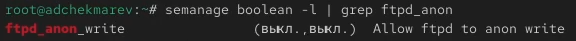

Изменим текущее значение переключателя для службы ftpd_anon_write с off на on: **setsebool ftpd_anon_write on** 
Повторно смотрим список переключателей SELinux для службы ftpd_anon_write: **getsebool ftpd_anon_write** 


Псмотрим список переключателей с пояснением: **semanage boolean -l | grep ftpd_anon**.

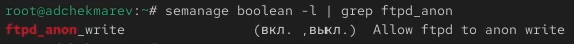

Мы видим, что настройка времени выполнения включена, но постоянная настройка по-прежнему отключена 

Изменим постоянное значение переключателя для службы ftpd_anon_write с off на on: **setsebool -P ftpd_anon_write on**
Снова посмотрим список переключателей: **semanage boolean -l | grep ftpd_anon**

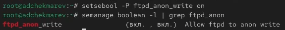

Теперь постоянная настройка включена 

# Контрольные вопросы

1. Вы хотите временно поставить SELinux в разрешающем режиме. Какую команду вы используете?

**setenforce 0**

2. Вам нужен список всех доступных переключателей SELinux. Какую команду вы используете?

**getsebool -a** 

3. Каково имя пакета, который требуется установить для получения легко читаемых сообщений журнала SELinux в журнале аудита?

**audit2allow**

4. Какие команды вам нужно выполнить, чтобы применить тип контекста httpd_sys_content_t к каталогу /web?

```
semanage fcontext -a -t httpd_sys_content_t "/web(/.*)?"
restorecon -R -v /web 
```

5. Какой файл вам нужно изменить, если вы хотите полностью отключить SELinux?

/etc/sysconfig/selinux

6. Где SELinux регистрирует все свои сообщения?

в /var/log/audit/audit.log 

7. Вы не знаете, какие типы контекстов доступны для службы ftp. Какая команда позволяет получить более конкретную информацию?

**getsebool -a | grep ftp** 

8. Ваш сервис работает не так, как ожидалось, и вы хотите узнать, связано ли это с SELinux или чем-то ещё. Какой самый простой способ узнать?

Просмотреть контекст безопасности процессора ps -eZ или id -Z 

# Выводы

В ходе выполнения лабораторной работы мы получили навыки и работы с контекстом безопасности и политиками SELinux

# Список литературы{.unnumbered}

::: {#refs}
:::
