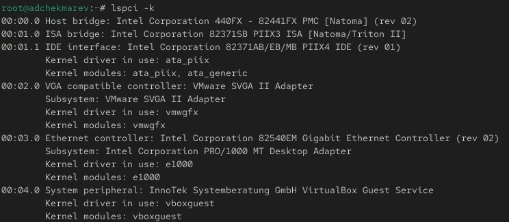
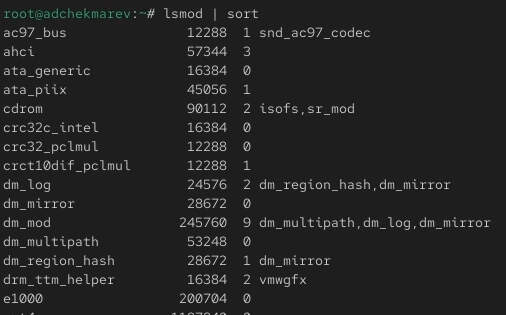
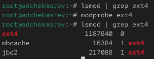
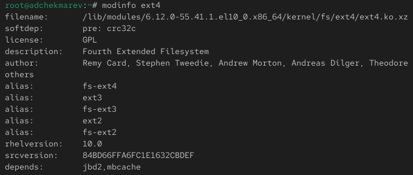
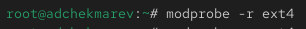
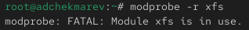
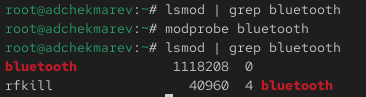
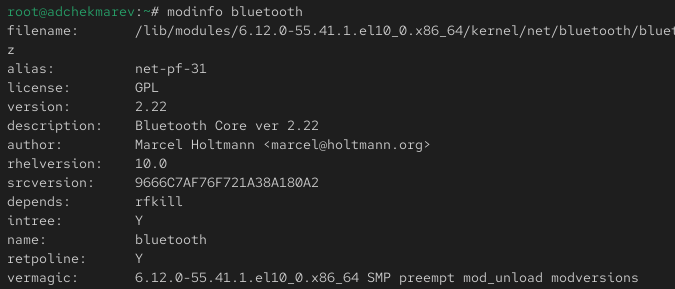
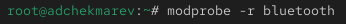
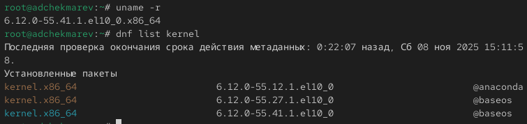

---
## Front matter
lang: ru-RU
title: Лабораторная работа №10
subtitle: Основы работы с модулями ядра операционной системы
author:
  - Чекмарев Александр Дмитриевич | Группа НПИбд-03-24
institute:
  - Российский университет дружбы народов, Москва, Россия
date: 7 Ноября 2025

## i18n babel
babel-lang: russian
babel-otherlangs: english

## Formatting pdf
toc: false
toc-title: Содержание
slide_level: 2
aspectratio: 169
section-titles: true
theme: warsaw

## Fonts
mainfont: Liberation Serif
romanfont: Liberation Serif
sansfont: Liberation Sans
monofont: Liberation Mono
mainfontoptions: Ligatures=TeX
romanfontoptions: Ligatures=TeX
sansfontoptions: Ligatures=TeX,Scale=MatchLowercase
monofontoptions: Scale=MatchLowercase,Scale=0.9
---

# Информация

## Докладчик

:::::::::::::: {.columns align=center}
::: {.column width="70%"}

  * Чекмарев Александр Дмитриевич
  * Группа НПИбд-03-24
  * Российский университет дружбы народов
  * <https://github.com/nenokixd?tab=repositories>

:::
::: {.column width="30%"}


:::
::::::::::::::

# Вводная часть

## Цель работы

Получить навыки работы с утилитами управления модулями ядра операционной системы.

## Задание

1. Продемонстрируйте навыки работы по управлению модулями ядра 
2. Продемонстрируйте навыки работы по загрузке модулей ядра с параметрами 

# Выполнение лабораторной работы

## Управление модулями ядра из командной строки

- Запускаем терминала и получаем полномочия суперпользователя
- Посмотрим, какие устройства имеются в нашей системе и какие модули ядра с ними связаны: **lspci -k**

{width=70%}

## Управление модулями ядра из командной строки

- Посмотрим, какие модули ядра загружены: **lsmod | sort** 

{width=70%}

## Управление модулями ядра из командной строки

- Посмотрим, загружен ли модуль ext4: **lsmod | grep ext4**. Он не загружен 
- Загрузим модуль ядра ext4 с помощью **modprobe ext4**
- Проверим, что модуль загружен, посмотрев список загруженных модулей: **lsmod | grep ext4**

{width=70%}

## Управление модулями ядра из командной строки

- Посмотрим информацию о модуле ядра ext4: **modinfo ext4** 

{width=70%}


## Управление модулями ядра из командной строки

- Попробуем выгрузить модуль ядра ext4: **modprobe -r ext4**. Все прошло с первого раза, без каких-либо ошибок

{width=70%}


## Управление модулями ядра из командной строки

- Попробуем выгрузить модуль ядра xfs: **modprobe -r xfs**. 
- Мы получили сообщение об ошибке, поскольку модуль ядра в данный момент используется

{width=70%}


## Загрузка модулей ядра с параметрами

- Посмотрим, загружен ли модуль bluetooth: **lsmod | grep bluetooth**. Он не загружен 
- Загрузим модуль ядра bluetooth с помощью **modprobe bluetooth** 
- Посмотрим список модулей ядра, отвечающих за работу с Bluetooth: **lsmod | grep bluetooth** 

{width=70%}

## Загрузка модулей ядра с параметрами


- Посмотрим информацию о модуле bluetooth: **modinfo bluetooth** 

{width=70%}

## Загрузка модулей ядра с параметрами

- Выгрузим модуль ядра bluetooth: **modprobe -r bluetooth** 

{width=70%}

## Обновление ядра системы

- Посмотрим версию ядра, используемую в операционной системе: **uname -r** 
- Выведим на экран список пакетов, относящихся к ядру операционной системы: **dnf list kernel** 

{width=70%}

## Обновление ядра системы

- Обновим систему, чтобы убедиться, что все существующие пакеты обновлены, так как это важно при установке/обновлении ядер Linux и избежания конфликтов: **dnf upgrade --refresh** 

{width=70%}


## Обновление ядра системы

Далее обновим ядро операционной системы, а затем саму операционную систему: 

```
dnf update kernel
dnf update
dnf upgrade --refresh
```

{width=70%}

## Обновление ядра системы

- После, перегрузим систему и при загрузке выберим новое ядро.
- Теперь посмотрим версию ядра, используемую в операционной системе: **uname -r** и **hostnamectl**  
- Мы видим, название ядра изменилось

{width=70%}

# Подведение итогов

## Выводы

В ходе выполнения лабораторной работы были получены навыки работы с утилитами управления модулями ядра операционной системы.
