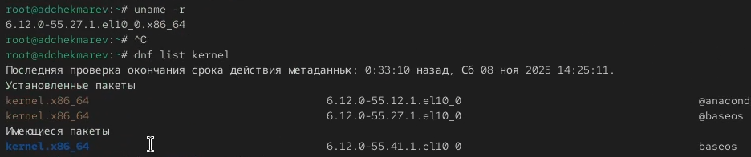
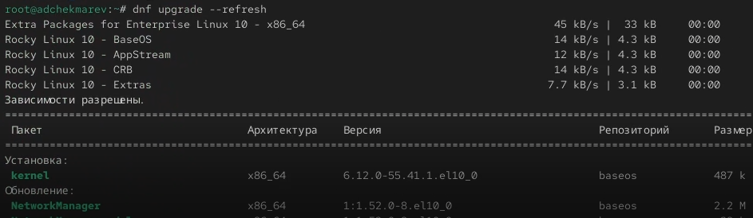
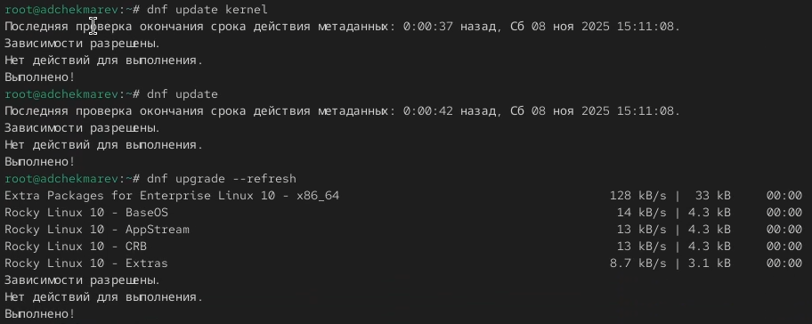

---
# Preamble

## Author
author:
  name: Чекмарев Александр Дмитриевич | группа НПИбд 03-24
  affiliation:
    - name: Российский университет дружбы народов
      country: Российская Федерация
   
## Title
title: "Лабораторная работа №10"
subtitle: "Основы работы с модулями ядра операционной системы"
license: "CC BY"
## Generic options
lang: ru-RU
number-sections: true
toc: true
toc-title: "Содержание"
toc-depth: 2
## Crossref customization
crossref:
  lof-title: "Список иллюстраций"
  lot-title: "Список таблиц"
  lol-title: "Листинги"
## Bibliography
bibliography:
  - bib/cite.bib
csl: _resources/csl/gost-r-7-0-5-2008-numeric.csl
## Formats
format:
### Pdf output format
  pdf:
    toc: true
    number-sections: true
    colorlinks: false
    toc-depth: 2
    lof: true # List of figures
    lot: true # List of tables
#### Document
    documentclass: scrreprt
    papersize: a4
    fontsize: 12pt
    linestretch: 1.5
#### Language
    babel-lang: russian
    babel-otherlangs: english
#### Biblatex
    cite-method: biblatex
    biblio-style: gost-numeric
    biblatexoptions:
      - backend=biber
      - langhook=extras
      - autolang=other*
#### Misc options
    csquotes: true
    indent: true
    header-includes: |
      \usepackage{indentfirst}
      \usepackage{float}
      \floatplacement{figure}{H}
      \usepackage[math,RM={Scale=0.94},SS={Scale=0.94},SScon={Scale=0.94},TT={Scale=MatchLowercase,FakeStretch=0.9},DefaultFeatures={Ligatures=Common}]{plex-otf}
### Docx output format
  docx:
    toc: true
    number-sections: true
    toc-depth: 2
---

# Цель работы

Получить навыки работы с утилитами управления модулями ядра операционной системы.

# Задание

1. Продемонстрируйте навыки работы по управлению модулями ядра 
2. Продемонстрируйте навыки работы по загрузке модулей ядра с параметрами 

# Выполнение лабораторной работы

##  Управление модулями ядра из командной строки

Запускаем терминала и получаем полномочия суперпользователя.
Посмотрим, какие устройства имеются в нашей системе и какие модули ядра с ними связаны: **lspci -k**


Пояснения.

1. Host bridge:

- Устройство: Intel Corporation 440FX - 82441FX PMC [Natoma] (rev 02)
- Это основной мост, который управляет связью между процессором и другими компонентами.
- Модуль ядра: отсутствует, так как это устройство не требует специального драйвера в Linux.

2. ISA bridge:

- Устройство: Intel Corporation 82371SB PIIX3 ISA [Natoma/Triton II]
- Обеспечивает поддержку шины ISA, которая используется для подключения старых устройств.
- Модуль ядра: отсутствует.

3. IDE interface:

- Устройство: Intel Corporation 82371AB/EB/MB PIIX4 IDE (rev 01)
- Это интерфейс для подключения IDE-устройств, таких как жёсткие диски.
- Модуль ядра: ata_piix, ata_generic, что означает, что система использует драйвер для управления IDE-устройствами.

4. VGA compatible controller:

- Устройство: VMware SVGA II Adapter
- Это видеокарта, предоставляемая средой виртуализации VMware.
- Модуль ядра: vmwgfx, используемый драйвер для поддержки графики в VMware.

5. Ethernet controller:

- Устройство: Intel Corporation 82540EM Gigabit Ethernet Controller
- Это сетевой адаптер, обеспечивающий подключение к сети.
- Модуль ядра: e1000, используемый драйвер для этого типа сетевых карт.

6. System peripheral:

- Устройство: InnoTek Systemberatung GmbH VirtualBox Guest Service
- Это системное устройство, предоставляемое VirtualBox для интеграции с гостевой операционной системой.
- Модуль ядра: vboxguest, который позволяет гостевой системе взаимодействовать с хостом.

7. Multimedia audio controller:

- Устройство: Intel Corporation 82801AA AC'97 Audio Controller 
- Это аудиоконтроллер, обеспечивающий воспроизведение и запись звука.
- Модуль ядра: snd_intel8x0, драйвер для контроллеров AC'97.

8. USB controller: Apple Inc. KeyLargo/Intrepid USB

- Контроллер USB от Apple. VirtualBox эмулирует его для обеспечения работы USB-устройств, подключаемых к виртуальной машине.
- Драйвер: ohci-pci — драйвер для контроллеров USB 1.1 (OHCI).

9. Bridge: Intel Corporation 82371AB/EB/MB PIIX4 ACPI

- Этот мост отвечает за поддержку ACPI (Advanced Configuration and Power Interface), который управляет питанием (спящий режим, гибернация) и конфигурацией оборудования.
- Драйвер: piix4_smbus — драйвер для системной шины SMBus, которая используется для общения с датчиками на материнской плате.

10. USB controller: Intel Corporation 82801FB/FBM/FR/FW/FRW (ICH6 Family) USB2 EHCI Controller

- Контроллер для высокоскоростных устройств USB 2.0.
- Драйвер: ehci-pci — драйвер для контроллеров USB 2.0 (EHCI).

11. SATA controller: Intel Corporation 82801HM/HEM (ICH8M/ICH8M-E) SATA Controller [AHCI mode]

- Основной контроллер для виртуальных жестких дисков. Он работает в современном режиме AHCI, который поддерживает такие функции, как горячая замена и Native Command Queuing (NCQ).
- Драйвер: ahci — стандартный драйвер Linux для контроллеров SATA в режиме AHCI.


Посмотрим, какие модули ядра загружены: **lsmod | sort** 


Посмотрим, загружен ли модуль ext4: **lsmod | grep ext4**. Он не загружен 
Загрузим модуль ядра ext4 с помощью **modprobe ext4**
Проверим, что модуль загружен, посмотрев список загруженных модулей: **lsmod | grep ext4**


Посмотрим информацию о модуле ядра ext4: **modinfo ext4** 


Пояснения. 

1. filename: /lib/modules/5.14.0-427.13.1.el9_4.x86_64/kernel/fs/ext4/ext4.ko.xz
   - Это путь к файлу модуля ext4 в системе. Он хранится сжатым (xz) в каталоге модулей ядра для версии ядра 5.14.0-427.13.1.el9_4.x86_64.

2. license: GPL
   - Лицензия модуля — GNU General Public License (GPL), что делает его свободным программным обеспечением.

3. description: Fourth Extended Filesystem
   - Описание модуля — файловая система четвёртого расширенного типа, также известная как Ext4.

4. author: Remy Card, Stephen Tweedie, Andrew Morton, Andreas Dilger, Theodore Ts'o and others
   - Список авторов, которые разработали и поддерживают модуль ext4.

5. alias: fs-ext4, ext3, fs-ext3, ext2, fs-ext2
   - Псевдонимы для модуля, указывающие на совместимость с файловыми системами ext3 и ext2. Это позволяет использовать модуль ext4 для работы с Ext2 и Ext3.

6. rhelversion: 9.4
   - Версия Red Hat Enterprise Linux (RHEL), с которой связан данный модуль, — 9.4.

7. srcversion: 2B896FAB53D489F1C7683E6
   - Уникальный идентификатор версии исходного кода модуля.

8. depends: mbcache, jbd2
   - Модуль зависит от других модулей ядра: mbcache (memory block cache) и jbd2 (журналирование).

9. retpoline: Y
   - Этот параметр указывает, что модуль поддерживает защиту от уязвимостей Spectre (Retpoline).

10. intree: Y
   - Показывает, что модуль является встроенным в ядро Linux и поддерживается на уровне официального исходного кода.

11. name: ext4
   - Имя модуля.

12. vermagic: 5.14.0-427.13.1.el9_4.x86_64 SMP preempt mod_unload modversions
   
* Информация о версии ядра, для которой скомпилирован этот модуль. Она включает:
  + Версию ядра (5.14.0-427.13.1.el9_4.x86_64)
  + Поддержку симметричной многопоточности (SMP)
  + Поддержку предвыборки задач (preempt)
  + Возможность выгрузки модуля (mod_unload)
  + Версионирование модулей (modversions).

13. sig_id, signer, sig_key, sig_hashalgo, signature:
   
* Информация о цифровой подписи модуля:
  + sig_id: Тип подписи, здесь используется PKCS#7.
  + signer: Подпись, используемая Rocky kernel signing key.
  + sig_key: Ключ, используемый для подписания модуля.
  + sig_hashalgo: Алгоритм хеширования, используемый для подписи (sha256).
  + signature: Цифровая подпись модуля, которая подтверждает его подлинность и целостность.


Попробуем выгрузить модуль ядра ext4: **modprobe -r ext4**. Все прошло с первого раза, без каких-либо ошибок


Попробуем выгрузить модуль ядра xfs: **modprobe -r xfs**. Мы получили сообщение об ошибке, поскольку модуль ядра в данный момент используется


## Загрузка модулей ядра с параметрами


Посмотрим, загружен ли модуль bluetooth: **lsmod | grep bluetooth**. Он не загружен 
Загрузим модуль ядра bluetooth с помощью **modprobe bluetooth** 
Посмотрим список модулей ядра, отвечающих за работу с Bluetooth: **lsmod | grep bluetooth** 


Посмотрим информацию о модуле bluetooth: **modinfo bluetooth** 


Выгрузим модуль ядра bluetooth: **modprobe -r bluetooth** 


## Обновление ядра системы

Посмотрим версию ядра, используемую в операционной системе: **uname -r** 
Выведим на экран список пакетов, относящихся к ядру операционной системы: **dnf list kernel** 



Обновим систему, чтобы убедиться, что все существующие пакеты обновлены, так как это важно при установке/обновлении ядер Linux и избежания конфликтов: **dnf upgrade --refresh** 



Далее обновим ядро операционной системы, а затем саму операционную систему: 

```
dnf update kernel
dnf update
dnf upgrade --refresh
```




После, перегрузим систему и при загрузке выберим новое ядро.
Теперь посмотрим версию ядра, используемую в операционной системе: **uname -r** и **hostnamectl**  
Мы видим, название ядра изменилось


# Контрольные вопросы

1. Какая команда показывает текущую версию ядра, которая используется на вашей системе?

uname -r

2. Как можно посмотреть более подробную информацию о текущей версии ядра операционной системы?

Все детали о системе и ядре **uname -a**

Только информация о сборке ядра **cat /proc/version**

Информация о дистрибутиве и ядре **hostnamectl**

3. Какая команда показывает список загруженных модулей ядра?

Краткий список **lsmod**

Подробный список с информацией **lsmod | less**

4. Какая команда позволяет вам определять параметры модуля ядра?

Для просмотра параметров конкретного модуля **modinfo имя_модуля**

5. Как выгрузить модуль ядра?

Базовая команда **- sudo modprobe -r имя_модуля**

Или с помощью rmmod **- sudo rmmod имя_модуля**

6. Что вы можете сделать, если получите сообщение об ошибке при попытке выгрузить модуль ядра?

Если модуль нельзя выгрузить, обычно это означает:
Модуль используется другим процессом или модулем
Зависимости - другие модули зависят от него
Решение:

Посмотреть зависимости модуля **modprobe --show-depends имя_модуля**

Проверить, какие процессы используют модуль **lsof | grep имя_модуля**

Или использовать lsmmod для просмотра зависимостей **lsmod | grep имя_модуля**

7. Как определить, какие параметры модуля ядра поддерживаются?

Показать все параметры модуля - **modinfo имя_модуля**


8. Как установить новую версию ядра?

Способ 1 - через официальные репозитории:

Обновить систему/ядро

```
dnf update kernel
dnf update
dnf upgrade --refresh
```

Способ 2 - установка из репозитория ELRepo (Подробности лучше посмотреть в интернете)


# Выводы

В ходе выполнения лабораторной работы были получены навыки работы с утилитами управления модулями ядра операционной системы.


# Список литературы{.unnumbered}

::: {#refs}
:::
