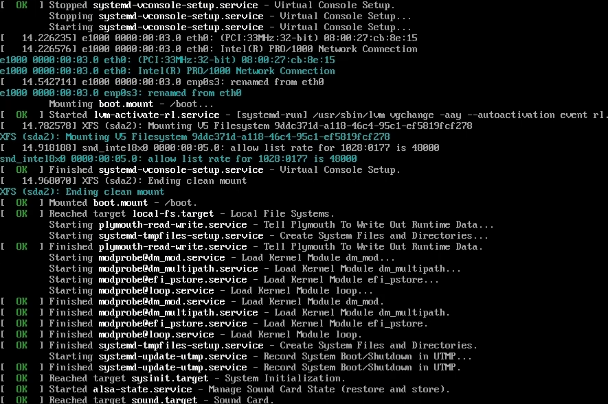
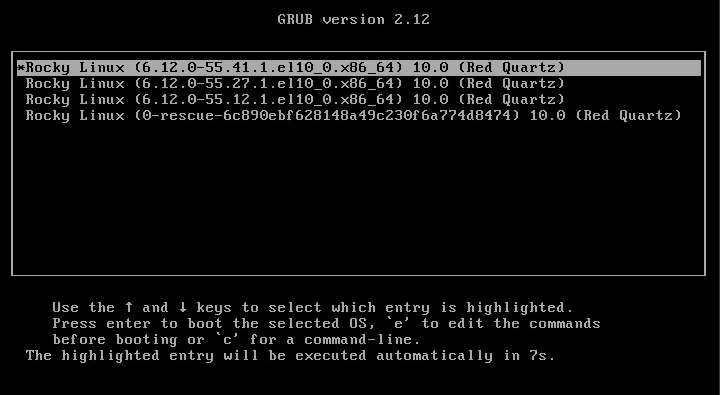
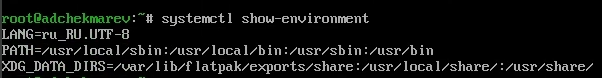
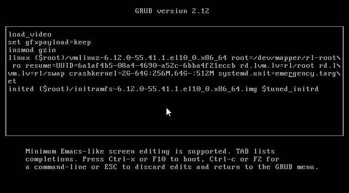
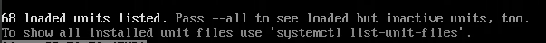
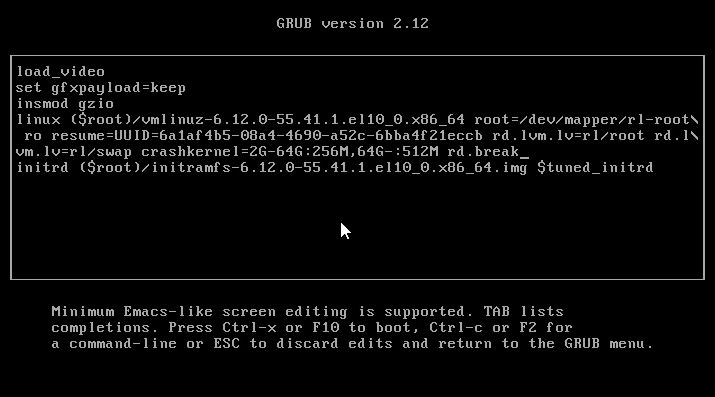

---
## Front matter
lang: ru-RU
title: Лабораторная работа №11
subtitle: Управление загрузкой системы
author:
  - Чекмарев Александр Дмитриевич | Группа НПИбд-03-24
institute:
  - Российский университет дружбы народов, Москва, Россия
date: 15 Ноября 2025

## i18n babel
babel-lang: russian
babel-otherlangs: english

## Formatting pdf
toc: false
toc-title: Содержание
slide_level: 2
aspectratio: 169
section-titles: true
theme: warsaw

## Fonts
mainfont: Liberation Serif
romanfont: Liberation Serif
sansfont: Liberation Sans
monofont: Liberation Mono
mainfontoptions: Ligatures=TeX
romanfontoptions: Ligatures=TeX
sansfontoptions: Ligatures=TeX,Scale=MatchLowercase
monofontoptions: Scale=MatchLowercase,Scale=0.9
---

# Информация

## Докладчик

:::::::::::::: {.columns align=center}
::: {.column width="70%"}

  * Чекмарев Александр Дмитриевич
  * Группа НПИбд-03-24
  * Российский университет дружбы народов
  * <https://github.com/nenokixd?tab=repositories>

:::
::: {.column width="30%"}

:::
::::::::::::::

# Вводная часть

## Цель работы

Получить навыки работы с загрузчиком системы GRUB2

## Задание

1. Продемонстрировать навыки по изменению параметров GRUB и записи изменений в файл конфигурации
2. Продемонстрировать навыки устранения неполадок при работе с GRUB
3. Продемонстрировать навыки работы с GRUB без использования root

# Выполнение лабораторной работы

##  Модификация параметров GRUB2

- Запускаем терминала и получаем полномочия администратора.
- В файле /etc/default/grub устанавливаем параметр отображения меню загрузки в течение 10 секунд: **GRUB_TIMEOUT=10**

{width=70%}

{width=70%}

##  Модификация параметров GRUB2

- Запишим изменения в GRUB2, введя в командной строке **grub2-mkconfig > /boot/grub2/grub.cfg**

{width=70%}

##  Модификация параметров GRUB2

- Перезагружаем систему.
- При загрузке системы мы увидим прокрутку загрузочных сообщений 

{width=50%}

##  Модификация параметров GRUB2

- После загрузочных сообщений увидим меню grub с изменённым таймером

{width=70%}

##  Устранения неполадок

- Перезагружаем систему. Как только появляется меню GRUB, выбираем строку с текущей версией ядра в меню и нажимаем **e** для редактирования.
- Прокручиваем вниз до строки, начинающейся с linux ($root)/vmlinuz-. 
- Эта строка загружает ядро системы. В конце этой строки вводим **systemd.unit=rescue.target** и удаляем опции **rhgb** и **quit** из этой строки.

{width=70%}

##  Устранения неполадок

- Для продолжения загрузки нажимаем **ctrl+x**. После этого вводим пароль пользователя root при появлении запроса 
- Посмотрим список всех файлов модулей, которые загружены в настоящее время: **systemctl list-units**

{width=70%}

##  Модификация параметров GRUB2

- Мы видим, что загружена базовая системная среда 

{width=70%}

## Устранения неполадок

- Посмотрим задействованные переменные среды оболочки: **systemctl show-environment**

{width=70%}

## Устранения неполадок

- Перезагружаем систему, используя команду **systemctl reboot** 
- Снова открываем меню GRUB в режиме редактора. В конце строки, загружающей ядро, вводим **systemd.unit=emergency.target**, удаляем опции **rhgb** и **quit** из этой строки.

{width=70%}

## Устранения неполадок

- Снова вводим пароль пользователя root. После успешного входа в систему смотрим список всех загруженных файлов модулей: **systemctl list-units**. 

{width=70%}

- Количество загружаемых файлов модулей уменьшилось до минимума.
- Снова перезагружаем систему 

## Сброс пароля root

- Обычный сценарий для администратора Linux заключается в том, что пароль root отсутствует. Если это произойдёт, вам необходимо сбросить его. Единственный способ сделать это — загрузить систему в минимальном режиме, который позволяет войти в систему без ввода пароля. Для этого выполните следующие действия.
- Когда отобразится меню GRUB, выберем в меню строку с текущей версией ядра системы и нажмем e , чтобы войти в режим редактора.
- В конце строки, загружающей ядро, введем **rd.break** и удалим опции **rhgb** и **quit** из этой строки.

{width=50%}

## Сброс пароля root

- Этап загрузки системы остановится в момент загрузки initramfs, непосредственно перед монтированием корневой файловой системы в каталоге /.
- Чтобы получить доступ к системному образу для чтения и записи, набираем **mount -o remount,rw /sysroot**
- Сделаем содержимое каталога /sysimage новым корневым каталогом, набрав **chroot /sysroot** 
- Теперь мы можем ввести команду задания пароля: **passwd**. Установим новый пароль для пользователя root 

{width=50%}

## Сброс пароля root

- Поскольку на этом очень раннем этапе загрузки SELinux ещё не активирован, то тип контекста SELinux для файла /etc/shadow будет испорчен. 
- Если мы перезагрузимся в этот момент, то никто не сможет войти в систему. Поэтому мы должны убедиться, что тип контекста установлен правильно. 
- Чтобы сделать это, на этом этапе мы загружаем политику SELinux с помощью команды **load_policy -i** 

{width=70%}

## Сброс пароля root

- Теперь мы можем вручную установить правильный тип контекста для /etc/shadow. Для этого вводим **chcon -t shadow_t /etc/shadow** 

{width=70%}

- Перезагрузим операционную систему с помощью **reboot -f**
- Опция -f (--force) означает принудительную немедленную остановку, выключение или перезагрузку. При указании один раз это приводит к немедленному, но чистому завершению работы системным менеджером. Если указано дважды, это приводит к немедленному завершению работы без обращения к системному менеджеру 
- Теперь можем зайти в учётную запись пользователя root, с помощью нового пароля. 

# Подведение итогов

## Выводы

В ходе выполнения лабораторной работы мы получили навыки работы с загрузчиком системы GRUB2
