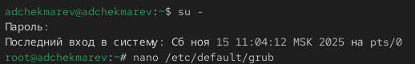
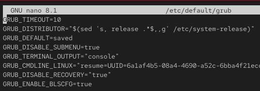
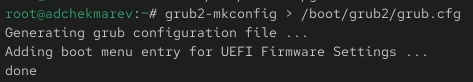
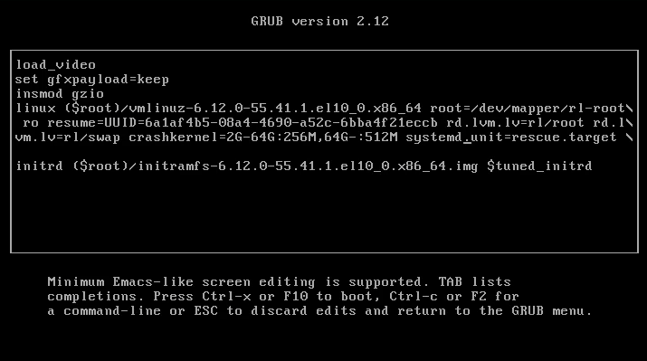
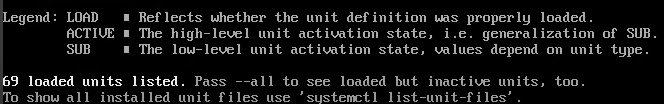
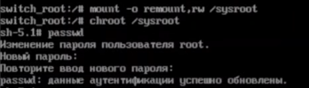
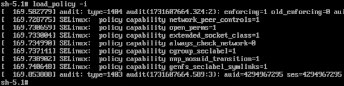
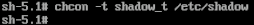

---
# Preamble

## Author
author:
  name: Чекмарев Александр Дмитриевич | группа НПИбд 03-24
  affiliation:
    - name: Российский университет дружбы народов
      country: Российская Федерация
   
## Title
title: "Лабораторная работа №11"
subtitle: "Управление загрузкой системы"
license: "CC BY"
## Generic options
lang: ru-RU
number-sections: true
toc: true
toc-title: "Содержание"
toc-depth: 2
## Crossref customization
crossref:
  lof-title: "Список иллюстраций"
  lot-title: "Список таблиц"
  lol-title: "Листинги"
## Bibliography
bibliography:
  - bib/cite.bib
csl: _resources/csl/gost-r-7-0-5-2008-numeric.csl
## Formats
format:
### Pdf output format
  pdf:
    toc: true
    number-sections: true
    colorlinks: false
    toc-depth: 2
    lof: true # List of figures
    lot: true # List of tables
#### Document
    documentclass: scrreprt
    papersize: a4
    fontsize: 12pt
    linestretch: 1.5
#### Language
    babel-lang: russian
    babel-otherlangs: english
#### Biblatex
    cite-method: biblatex
    biblio-style: gost-numeric
    biblatexoptions:
      - backend=biber
      - langhook=extras
      - autolang=other*
#### Misc options
    csquotes: true
    indent: true
    header-includes: |
      \usepackage{indentfirst}
      \usepackage{float}
      \floatplacement{figure}{H}
      \usepackage[math,RM={Scale=0.94},SS={Scale=0.94},SScon={Scale=0.94},TT={Scale=MatchLowercase,FakeStretch=0.9},DefaultFeatures={Ligatures=Common}]{plex-otf}
### Docx output format
  docx:
    toc: true
    number-sections: true
    toc-depth: 2
---

# Цель работы

Получить навыки работы с загрузчиком системы GRUB2.

# Задание

1. Продемонстрируйте навыки по изменению параметров GRUB и записи изменений в файл конфигурации
2. Продемонстрируйте навыки устранения неполадок при работе с GRUB 
3. Продемонстрируйте навыки работы с GRUB без использования root 

# Выполнение лабораторной работы

##  Модификация параметров GRUB2

Запускаем терминала и получаем полномочия администратора.
В файле /etc/default/grub устанавливаем параметр отображения меню загрузки в течение 10 секунд: **GRUB_TIMEOUT=10**

Запишим изменения в GRUB2, введя в командной строке **grub2-mkconfig > /boot/grub2/grub.cfg**

После этого перезагружаем систему.
При загрузке системы мы увидим прокрутку загрузочных сообщений

## Устранения неполадок

Перезагружаем систему. Как только появляется меню GRUB, выбираем строку с текущей версией ядра в меню и нажимаем **e** для редактирования.

Прокручиваем вниз до строки, начинающейся с linux ($root)/vmlinuz-. 
Эта строка загружает ядро системы. В конце этой строки вводим **systemd.unit=rescue.target** и удаляем опции **rhgb** и **quit** из этой строки.

Для продолжения загрузки нажимаем **ctrl+x**. После этого вводим пароль пользователя root при появлении запроса 
Посмотрим список всех файлов модулей, которые загружены в настоящее время: **systemctl list-units**

Мы видим, что загружена базовая системная среда 

Посмотрим задействованные переменные среды оболочки: **systemctl show-environment**

После перезагружаем систему, используя команду **systemctl reboot** 
Снова открываем меню GRUB в режиме редактора. В конце строки, загружающей ядро, вводим **systemd.unit=emergency.target**, удаляем опции **rhgb** и **quit** из этой строки.

Снова вводим пароль пользователя root. После успешного входа в систему смотрим список всех загруженных файлов модулей: **systemctl list-units**. 

{#fig:022 width=70%}

Количество загружаемых файлов модулей уменьшилось до минимума.

Снова перезагружаем систему 

## Сброс пароля root

Обычный сценарий для администратора Linux заключается в том, что пароль root отсутствует. Если это произойдёт, вам необходимо сбросить его. Единственный способ сделать это — загрузить систему в минимальном режиме, который позволяет войти в систему без ввода пароля. Для этого выполните следующие действия.

Когда отобразится меню GRUB, выберем в меню строку с текущей версией ядра системы и нажмем e , чтобы войти в режим редактора.
В конце строки, загружающей ядро, введем **rd.break** и удалим опции **rhgb** и **quit** из этой строки.

P.S rd.break в моем случае не останавливало меня перед монтированием корневой системы. Поиск решения проблемы ничего не дал, поэтому пришлось взять скриншоты с работ других студентов.

Этап загрузки системы остановится в момент загрузки initramfs, непосредственно перед монтированием корневой файловой системы в каталоге /.
Чтобы получить доступ к системному образу для чтения и записи, набираем **mount -o remount,rw /sysroot**
Сделаем содержимое каталога /sysimage новым корневым каталогом, набрав **chroot /sysroot** 
Теперь мы можем ввести команду задания пароля: **passwd**. Установим новый пароль для пользователя root 

Поскольку на этом очень раннем этапе загрузки SELinux ещё не активирован, то тип контекста SELinux для файла /etc/shadow будет испорчен. 
Если мы перезагрузимся в этот момент, то никто не сможет войти в систему. Поэтому мы должны убедиться, что тип контекста установлен правильно. 
Чтобы сделать это, на этом этапе мы загружаем политику SELinux с помощью команды **load_policy -i** 

Теперь мы можем вручную установить правильный тип контекста для /etc/shadow. Для этого вводим **chcon -t shadow_t /etc/shadow** 

Посел перезагрузим операционную систему с помощью **reboot -f**
Опция -f (--force) означает принудительную немедленную остановку, выключение или перезагрузку. При указании один раз это приводит к немедленному, но чистому завершению работы системным менеджером. Если указано дважды, это приводит к немедленному завершению работы без обращения к системному менеджеру 

Теперь заходим в учётную запись пользователя root, с помощью нового пароля. 

# Контрольные вопросы

1. Какой файл конфигурации следует изменить для применения общих изменений в GRUB2?

**/etc/default/grub**

2. Как называется конфигурационный файл GRUB2, в котором вы применяете изменения для GRUB2?

**/boot/grub2/grub.cfg**

3. После внесения изменений в конфигурацию GRUB2, какую команду вы должны выполнить, чтобы изменения сохранились и воспринялись при загрузке системы?

Записать изменения в GRUB2, введя в командной строке **grub2-mkconfig > /boot/grub2/grub.cfg** или **grub2-mkconfig -o /boot/grub2/grub.cfg** 

# Выводы

В ходе выполнения лабораторной работы мы получили навыки работы с загрузчиком системы GRUB2

# Список литературы{.unnumbered}

::: {#refs}
:::
