---
## Front matter
lang: ru-RU
title: Лабораторная работа №12
subtitle: Настройки сети в Linux
author:
  - Чекмарев Александр Дмитриевич | Группа НПИбд-03-24
institute:
  - Российский университет дружбы народов, Москва, Россия
date: 20 Декабря 2025

## i18n babel
babel-lang: russian
babel-otherlangs: english

## Formatting pdf
toc: false
toc-title: Содержание
slide_level: 2
aspectratio: 169
section-titles: true
theme: warsaw

## Fonts
mainfont: Liberation Serif
romanfont: Liberation Serif
sansfont: Liberation Sans
monofont: Liberation Mono
mainfontoptions: Ligatures=TeX
romanfontoptions: Ligatures=TeX
sansfontoptions: Ligatures=TeX,Scale=MatchLowercase
monofontoptions: Scale=MatchLowercase,Scale=0.9
---

# Информация

## Докладчик

:::::::::::::: {.columns align=center}
::: {.column width="70%"}

  * Чекмарев Александр Дмитриевич
  * Группа НПИбд-03-24
  * Российский университет дружбы народов
  * <https://github.com/nenokixd?tab=repositories>

:::
::: {.column width="30%"}

:::
::::::::::::::

# Вводная часть

## Цель работы

Получить навыки настройки сетевых параметров системы.

## Задание

1. Продемонстрируйте навыки использования утилиты ip 
2. Продемонстрируйте навыки использования утилиты nmcli 

# Выполнение лабораторной работы

##  Проверка конфигурации сети

- Запускаем терминала и получаем полномочия суперпользователя.
- Выведем на экран информацию о существующих сетевых подключениях, а также статистику о количестве отправленных пакетов и связанных с ними сообщениях об ошибках: **ip -s link**

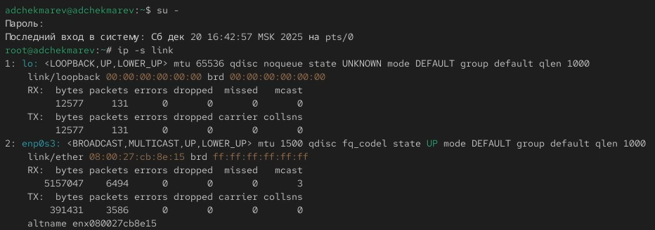{width=70%}

##  Проверка конфигурации сети

- Выведем на экран информацию о текущих маршрутах: **ip route show** 

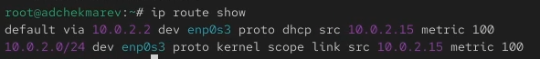{width=70%} 

##  Проверка конфигурации сети

- Выведем на экран информацию о текущих назначениях адресов для сетевых интерфейсов на устройстве: **ip addr show** 

{width=70%}

##  Проверка конфигурации сети

- Используем команду ping для проверки правильности подключения к Интернету. 
- Например, для отправки четырёх пакетов на IP-адрес 8.8.8.8 введём **ping -c 4 8.8.8.8**

{width=70%} 

##  Проверка конфигурации сети

- Добавим дополнительный адрес к нашему интерфейсу: **ip addr add 10.0.0.10/24 dev yourdevicename**
- Здесь *yourdevicename* — название интерфейса, которому добавляется IP-адрес. В нашем случаем это enp0s3
- Проверим, что адрес добавился: **ip addr show**

{width=60%}

##  Проверка конфигурации сети

- Теперь сравним вывод информации от утилиты **ip** и от команды **ifconfig** 

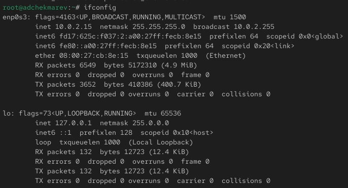{width=70%}

##  Проверка конфигурации сети

1. Команда ip:
- Используется для получения инструкций по использованию и расширенной функциональности
- Применяется для управления сетевым стеком более комплексно и детально
- Поддерживает как IPv4, так и IPv6, и предоставляет больше информации о взгляде на состояние всей сети

##  Проверка конфигурации сети

2. Команда ifconfig:
- Регулярно используется для быстрого доступа к основным данным о сетевых интерфейсах
- Выводит подробные статистические данные и состояние интерфейсов, но предоставляет меньше информации по сравнению с ip
- В основном используется для простых операций и поддерживается данными о сетевых интерфейсах без дополнительных параметров

##  Проверка конфигурации сети

- Выведем на экран список всех прослушиваемых системой портов UDP и TCP: **ss -tul** 

{width=70%} 

## Управление сетевыми подключениями с помощью nmcli

- Выведим на экран информацию о текущих соединениях: **nmcli connection show** 
- Добавим Ethernet-соединение с именем dhcp к интерфейсу: **nmcli connection add con-name "dhcp" type ethernet ifname ifname**. Здесь вместо **ifname** должно быть указано название интерфейса. В нашем случае это enp0s3 

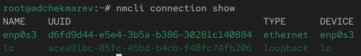{width=70%} 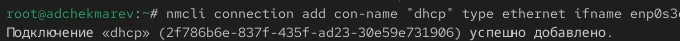{width=70%}

## Управление сетевыми подключениями с помощью nmcli

- Теперь добавим к этому же интерфейсу Ethernet-соединение с именем static, статическим IPv4-адресом адаптера и статическим адресом шлюза: **nmcli connection add con-name "static" ifname ifname autoconnect no type ethernet ip4 10.0.0.10/24 gw4 10.0.0.1 ifname ifname** 
- Снова выведим информацию о текущих соединениях: **nmcli connection show** 

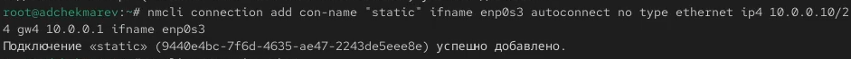{width=80%} {width=50%}

## Управление сетевыми подключениями с помощью nmcli

- Переключимся на статическое соединение: **nmcli connection up "static"**

{width=100%}

## Управление сетевыми подключениями с помощью nmcli

- Проверим успешность переключения при помощи **nmcli connection show** и **ip addr** 

{width=50%} 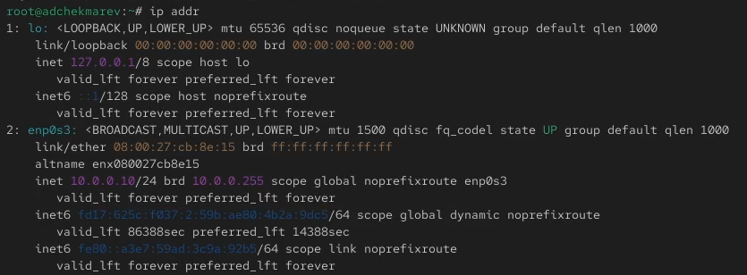{width=65%}

## Управление сетевыми подключениями с помощью nmcli

- Вернёмся к соединению dhcp: **nmcli connection up "dhcp"** 

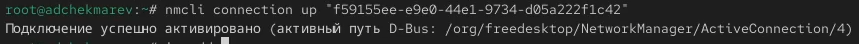{width=100%}

## Управление сетевыми подключениями с помощью nmcli

- Снова проверим успешность переключения при помощи **nmcli connection show** и **ip addr** 

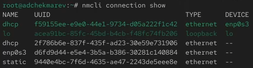{width=50%} 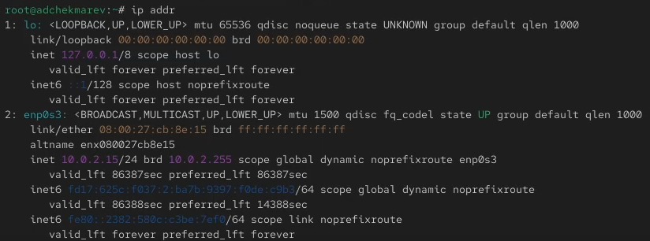{width=65%}

## Изменение параметров соединения с помощью nmcli

- Отключим автоподключение статического соединения: **nmcli connection modify "static" connection.autoconnect no** 
- Добавим DNS-сервер в статическое соединение: **nmcli connection modify "static" ipv4.dns 10.0.0.10**. При добавлении сетевого подключения используется ip4, а при изменении параметров для существующего соединения используется ipv4 
- Добавим второй DNS-сервер: **nmcli connection modify "static" +ipv4.dns 8.8.8.8**. Для добавления второго и последующих элементов для тех же параметров используется знак *+*. Если его проигнорировать, то произойдёт замена, а не добавление элемента

## Изменение параметров соединения с помощью nmcli

- Изменим IP-адрес статического соединения: **nmcli connection modify "static" ipv4.addresses 10.0.0.20/24**
- Добавим другой IP-адрес для статического соединения: **nmcli connection modify "static" +ipv4.addresses 10.20.30.40/16**
- После изменения свойств соединения активируем его: **nmcli connection up "static"**

{width=80%}

## Изменение параметров соединения с помощью nmcli

- Проверим успешность переключения при помощи **nmcli con show** и **ip addr** 

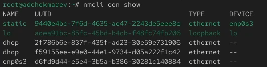{width=50%} {width=65%}

## Изменение параметров соединения с помощью nmcli

- Используя **nmtui** посмотрим настройки сетевых соединений в графическом интерфейсе операционной системы 

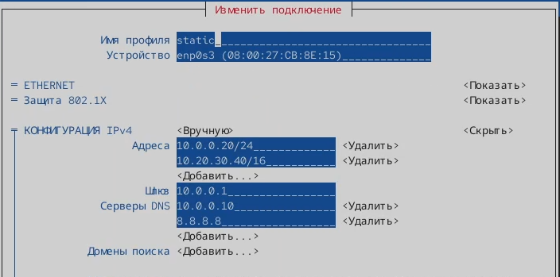{width=80%}

## Изменение параметров соединения с помощью nmcli

- Посмотрим настройки сетевых соединений в графическом интерфейсе операционной системы

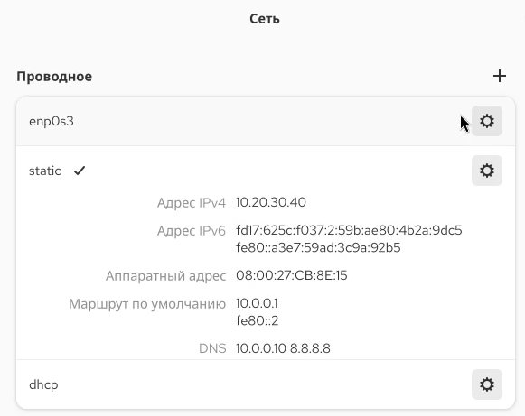{width=50%}

## Изменение параметров соединения с помощью nmcli

- Переключимся на первоначальное сетевое соединение: **nmcli connection up "ifname"**. В нашем случае на enp0s3 
- Проверим успешность переключения при помощи 

{width=100%} 

# Подведение итогов

## Выводы

В ходе выполнения лабораторной работы мы получили навыки настройки сетевых параметров системы
