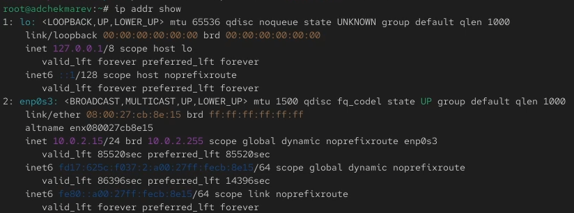
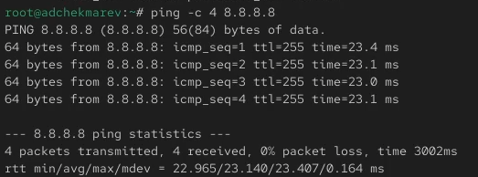
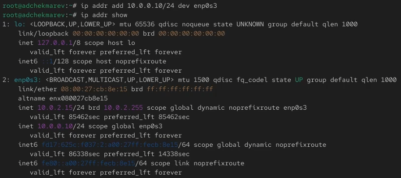
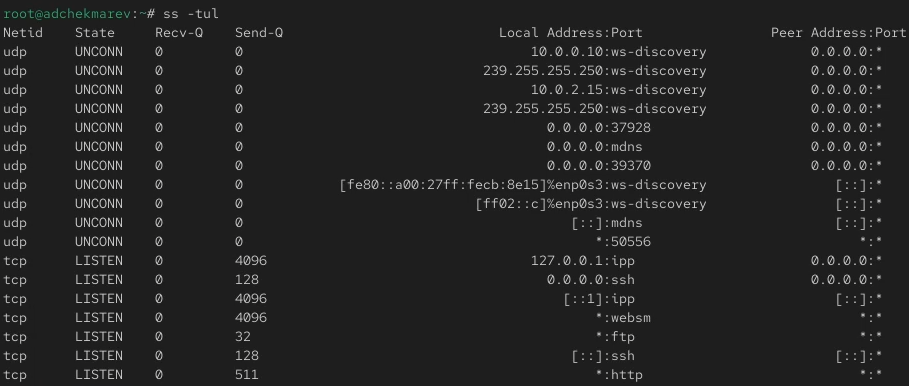
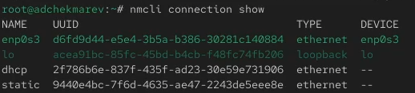
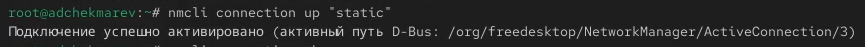
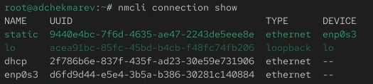
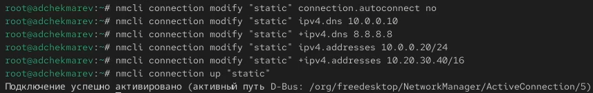
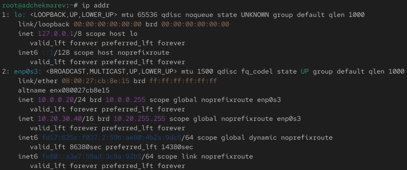
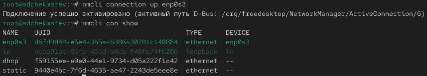

---
# Preamble

## Author
author:
  name: Чекмарев Александр Дмитриевич | группа НПИбд 03-24
  affiliation:
    - name: Российский университет дружбы народов
      country: Российская Федерация
   
## Title
title: "Лабораторная работа №12"
subtitle: "Настройки сети в Linux"
license: "CC BY"
## Generic options
lang: ru-RU
number-sections: true
toc: true
toc-title: "Содержание"
toc-depth: 2
## Crossref customization
crossref:
  lof-title: "Список иллюстраций"
  lot-title: "Список таблиц"
  lol-title: "Листинги"
## Bibliography
bibliography:
  - bib/cite.bib
csl: _resources/csl/gost-r-7-0-5-2008-numeric.csl
## Formats
format:
### Pdf output format
  pdf:
    toc: true
    number-sections: true
    colorlinks: false
    toc-depth: 2
    lof: true # List of figures
    lot: true # List of tables
#### Document
    documentclass: scrreprt
    papersize: a4
    fontsize: 12pt
    linestretch: 1.5
#### Language
    babel-lang: russian
    babel-otherlangs: english
#### Biblatex
    cite-method: biblatex
    biblio-style: gost-numeric
    biblatexoptions:
      - backend=biber
      - langhook=extras
      - autolang=other*
#### Misc options
    csquotes: true
    indent: true
    header-includes: |
      \usepackage{indentfirst}
      \usepackage{float}
      \floatplacement{figure}{H}
      \usepackage[math,RM={Scale=0.94},SS={Scale=0.94},SScon={Scale=0.94},TT={Scale=MatchLowercase,FakeStretch=0.9},DefaultFeatures={Ligatures=Common}]{plex-otf}
### Docx output format
  docx:
    toc: true
    number-sections: true
    toc-depth: 2
---

# Цель работы

Получить навыки настройки сетевых параметров системы.

# Задание

1. Продемонстрируйте навыки использования утилиты ip 
2. Продемонстрируйте навыки использования утилиты nmcli 

# Выполнение лабораторной работы

##  Проверка конфигурации сети

Запускаем терминала и получаем полномочия суперпользователя.
Выведем на экран информацию о существующих сетевых подключениях, а также статистику о количестве отправленных пакетов и связанных с ними сообщениях об ошибках: **ip -s link**

Пояснения к выведенной информации об интерфейсе enp0s3:

1. Тип: Ethernet
2. Состояние: UP (активный)
3. Группы: DEFAULT
4. MTU: 1500
5. MAC-адрес: 08:00:27:cb:8e:15 (реальный адрес)
6. Статистика: 

- RX (Received):
  + Байты: 5157047
  + Пакеты: 6494
  + Ошибки: 0
  + Пакеты, потерянные в процессе: 0
  + Мультикаст: 3
- TX (Transmitted):
  + Байты: 391341
  + Пакеты: 3586
  + Ошибки: 0
  + Пакеты, потерянные в процессе: 0
  + Коллизии: 0

Выведем на экран информацию о текущих маршрутах: **ip route show** 

Пояснения к выведенной информации о текущих маршрутах:

1. default via 10.0.2.2 dev enp0s3 proto dhcp src 10.0.2.15 metric 100:

- default: обозначает маршрут по умолчанию, который используется для передачи трафика в сети, если нет более специфического маршрута 
- via 10.0.2.2: указывает на шлюз (gateway), через который осуществляется выход в другие сети
- dev enp0s3: показывает сетевой интерфейс, который используется для этого маршрута (в данном случае — enp0s3)
- proto dhcp: маршрут был добавлен динамически через протокол DHCP
- src 10.0.2.15: указывает IP-адрес источника (адрес вашего устройства), который будет использоваться при исходящем трафике через этот маршрут
- metric 100: определяет приоритет маршрута. Чем меньше значение метрики, тем выше приоритет маршрута

2. 10.0.2.0/24 dev enp0s3 proto kernel scope link src 10.0.2.15 metric 100:

- 10.0.2.0/24: это маршрут для локальной подсети с диапазоном адресов от 10.0.2.0 до 10.0.2.255 (маска подсети — /24)
- dev enp0s3: указывает, что подсеть доступна через интерфейс enp0s3
- proto kernel: маршрут был добавлен ядром операционной системы автоматически, при конфигурировании интерфейса
- scope link: определяет, что маршрут доступен только через этот интерфейс (локально)
- src 10.0.2.15: показывает IP-адрес устройства в этой подсети
- metric 100: метрика маршрута (приоритет)

Выведем на экран информацию о текущих назначениях адресов для сетевых интерфейсов на устройстве: **ip addr show** 

Пояснения к выведенной информации о текущих назначениях адресов для сетевых интерфейсов на устройстве:

1. Состояние интерфейса: Указано как BROADCAST,MULTICAST,UP,LOWER_UP, что означает, что интерфейс активен, способен к широковещательной и мультикастовой передаче и успешно работает
2. Максимальный размер передаваемого пакета (MTU): В данном случае MTU равен 1500, что является стандартным значением для Ethernet интерфейсов
3. MAC-адрес: 08:00:27:cb:8e:15, который уникален для данного сетевого адаптера
4. IPv4-адрес: 10.0.2.15, что является частью подсети. Адрес указывает на то, что устройство может взаимодействовать в локальной сети
5. Сетевой префикс: 15, обозначающий, что сеть поддерживает 10.0.0.0/15 (это означает, что в этой сети может быть 2048 адресов)
6. Широковещательная адрес: 10.0.2.255, используемый для отправки данных всем устройствам в пределах подсети
7. Настройки маршрутизации: Указание noprefixroute говорит о том, что для данного адреса не установлены маршрутные префиксы
8. Название сетевого адаптера: enp0s3
9. IPv4-адрес устройства: 10.0.2.15

Далее используем команду ping для проверки правильности подключения к Интернету. Например, для отправки четырёх пакетов на IP-адрес 8.8.8.8 введём **ping -c 4 8.8.8.8**

Добавим дополнительный адрес к нашему интерфейсу: **ip addr add 10.0.0.10/24 dev yourdevicename**
Здесь *yourdevicename* — название интерфейса, которому добавляется IP-адрес. В нашем случаем это enp0s3
Проверим, что адрес добавился: **ip addr show**

Теперь сравним вывод информации от утилиты **ip** и от команды **ifconfig** 

Сравнение: 

1. Команда ip:
- Используется для получения инструкций по использованию и расширенной функциональности
- Применяется для управления сетевым стеком более комплексно и детально
- Поддерживает как IPv4, так и IPv6, и предоставляет больше информации о взгляде на состояние всей сети
2. Команда ifconfig:
- Регулярно используется для быстрого доступа к основным данным о сетевых интерфейсах
- Выводит подробные статистические данные и состояние интерфейсов, но предоставляет меньше информации по сравнению с ip
- В основном используется для простых операций и поддерживается данными о сетевых интерфейсах без дополнительных параметров

Выведем на экран список всех прослушиваемых системой портов UDP и TCP: **ss -tul** 

## Управление сетевыми подключениями с помощью nmcli

Выведим на экран информацию о текущих соединениях: **nmcli connection show** 

Добавим Ethernet-соединение с именем dhcp к интерфейсу: **nmcli connection add con-name "dhcp" type ethernet ifname ifname**. Здесь вместо **ifname** должно быть указано название интерфейса. В нашем случае это enp0s3 

Теперь добавим к этому же интерфейсу Ethernet-соединение с именем static, статическим IPv4-адресом адаптера и статическим адресом шлюза: **nmcli connection add con-name "static" ifname ifname autoconnect no type ethernet ip4 10.0.0.10/24 gw4 10.0.0.1 ifname ifname** 

Снова выведим информацию о текущих соединениях: **nmcli connection show** 

Переключимся на статическое соединение: **nmcli connection up "static"**

Проверим успешность переключения при помощи **nmcli connection show** и **ip addr** 

Вернёмся к соединению dhcp: **nmcli connection up "dhcp"** 

Снова проверим успешность переключения при помощи **nmcli connection show** и **ip addr** 

## Изменение параметров соединения с помощью nmcli

Отключим автоподключение статического соединения: **nmcli connection modify "static" connection.autoconnect no** 
Добавим DNS-сервер в статическое соединение: **nmcli connection modify "static" ipv4.dns 10.0.0.10**. При добавлении сетевого подключения используется ip4, а при изменении параметров для существующего соединения используется ipv4 
Добавим второй DNS-сервер: **nmcli connection modify "static" +ipv4.dns 8.8.8.8**. Для добавления второго и последующих элементов для тех же параметров используется знак *+*. Если его проигнорировать, то произойдёт замена, а не добавление элемента
Изменим IP-адрес статического соединения: **nmcli connection modify "static" ipv4.addresses 10.0.0.20/24**
Добавим другой IP-адрес для статического соединения: **nmcli connection modify "static" +ipv4.addresses 10.20.30.40/16**
После изменения свойств соединения активируем его: **nmcli connection up "static"**

Проверим успешность переключения при помощи **nmcli con show** и **ip addr** 

Используя **nmtui** посмотрим настройки сетевых соединений в графическом интерфейсе операционной системы 

Посмотрим настройки сетевых соединений в графическом интерфейсе операционной системы

Переключимся на первоначальное сетевое соединение: **nmcli connection up "ifname"**. В нашем случае на enp0s3 
Проверим успешность переключения при помощи 

# Контрольные вопросы

1. Какая команда отображает только статус соединения, но не IP-адрес?

**ip link или netstat**

2. Какая служба управляет сетью в ОС типа RHEL?

NetworkManager

3. Какой файл содержит имя узла (устройства) в ОС типа RHEL?

файл /etc/hosts – список всех хостов 
файл /etc/hostname – имя хоста локального устройства 

4. Какая команда позволяет вам задать имя узла (устройства)?

**hostnamectl set-hostname**

5. Какой конфигурационный файл можно изменить для включения разрешения имён для конкретного IP-адреса?

/etc/hosts

6. Какая команда показывает текущую конфигурацию маршрутизации?

**ip route show**

7. Как проверить текущий статус службы NetworkManager?

**systemctl status NetworkManager**

8. Какая команда позволяет вам изменить текущий IP-адрес и шлюз по умолчанию для вашего сетевого соединения?

- **nmcli con mod имя соединения ipv4.addresses "текущий ip,новый ip" gw4 новый ip** - изменить текущий ip адрес и шлюз
- **nmcli con mod имя соединения ipv4.addresses "текущий ip,новый ip"** - изменить текущий ip адрес
- **route add default GW новый ip название интерфейса** — изменить шлюз по умолчанию

# Выводы

В ходе выполнения лабораторной работы мы получили навыки настройки сетевых параметров системы

# Список литературы{.unnumbered}

::: {#refs}
:::
