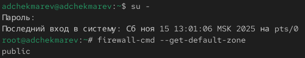
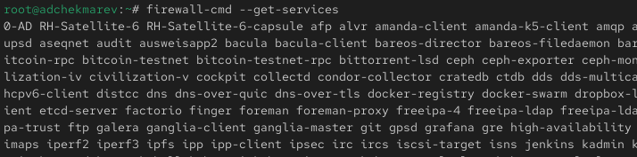
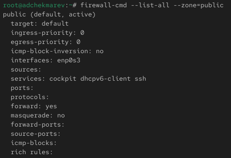
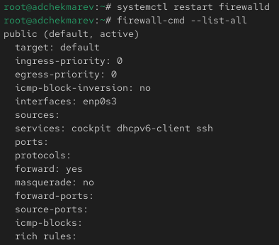
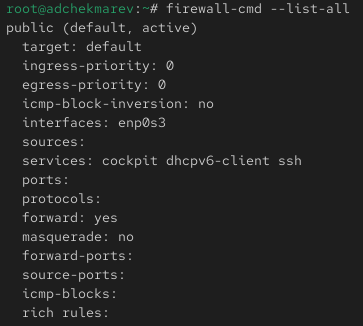
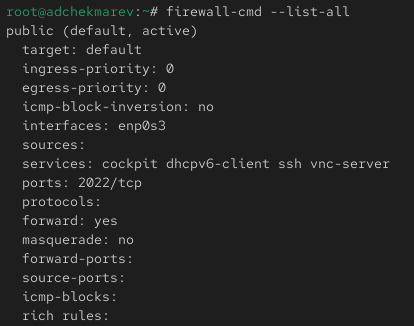
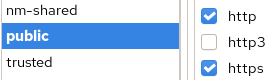
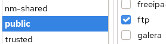
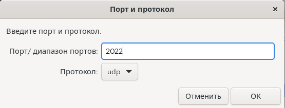
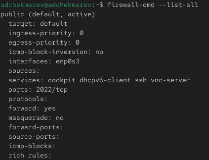

---
## Front matter
lang: ru-RU
title: Лабораторная работа №13
subtitle: Фильтр пакетов
author:
  - Чекмарев Александр Дмитриевич | Группа НПИбд-03-24
institute:
  - Российский университет дружбы народов, Москва, Россия
date: 29 Ноября 2025

## i18n babel
babel-lang: russian
babel-otherlangs: english

## Formatting pdf
toc: false
toc-title: Содержание
slide_level: 2
aspectratio: 169
section-titles: true
theme: warsaw

## Fonts
mainfont: Liberation Serif
romanfont: Liberation Serif
sansfont: Liberation Sans
monofont: Liberation Mono
mainfontoptions: Ligatures=TeX
romanfontoptions: Ligatures=TeX
sansfontoptions: Ligatures=TeX,Scale=MatchLowercase
monofontoptions: Scale=MatchLowercase,Scale=0.9
---

# Информация

## Докладчик

:::::::::::::: {.columns align=center}
::: {.column width="70%"}

  * Чекмарев Александр Дмитриевич
  * Группа НПИбд-03-24
  * Российский университет дружбы народов
  * <https://github.com/nenokixd?tab=repositories>

:::
::: {.column width="30%"}

:::
::::::::::::::

# Вводная часть

## Цель работы

Получить навыки настройки пакетного фильтра в Linux.

## Задание

1. Используя firewall-cmd:
– определить текущую зону по умолчанию;
– определить доступные для настройки зоны;
– определить службы, включённые в текущую зону;
– добавить сервер VNC в конфигурацию брандмауэра.
2. Используя firewall-config:
– добавьте службы http и ssh в зону public;
– добавьте порт 2022 протокола UDP в зону public;
– добавьте службу ftp.
3. Выполните задание для самостоятельной работы.

# Выполнение лабораторной работы

##  Управление брандмауэром с помощью firewall-cmd

- Получим полномочия администратора. 
- Определим текущую зону по умолчанию, введя: **firewall-cmd --get-default-zone**
- Определим доступные зоны, введя: **firewall-cmd --get-zones**

{width=70%} {width=70%}

##  Управление брандмауэром с помощью firewall-cmd

- Посмотрим службы, доступные на нашем компьютере, используя **firewall-cmd --get-services**

{width=70%}

##  Управление брандмауэром с помощью firewall-cmd

- Определим доступные службы в текущей зоне: **firewall-cmd --list-services**

{width=50%}

##  Управление брандмауэром с помощью firewall-cmd

- Сравним результаты вывода информации при использовании команды **firewall-cmd --list-all** и команды **firewall-cmd --list-all --zone=public**

{width=40%} {width=40%}

##  Управление брандмауэром с помощью firewall-cmd

- Добавим сервер VNC в конфигурацию брандмауэра: **firewall-cmd --add-service=vnc-server**
- Проверим, добавился ли vnc-server в конфигурацию: **firewall-cmd --list-all**

{width=45%} {width=40%}

## Управление брандмауэром с помощью firewall-cmd

- Перезапустим службу firewalld: **systemctl restart firewalld**
- Проверим, есть ли vnc-server в конфигурации: **firewall-cmd --list-all**

{width=34%}

- Обратим внимание, что служба vnc-server больше не указана. Его нет, так как служба vnc-server не постоянная.

## Управление брандмауэром с помощью firewall-cmd

- Добавим службу vnc-server ещё раз, но на этот раз сделаем её постоянной, используя команду **firewall-cmd --add-service=vnc-server --permanent**
- Проверим наличие vnc-server в конфигурации: **firewall-cmd --list-all**

{width=45%} {width=37%} 

- Мы увидим, что VNC-сервер не указан. Службы, которые были добавлены в конфигурацию на диске, автоматически не добавляются в конфигурацию времени выполнения.

## Управление брандмауэром с помощью firewall-cmd
- Перезагрузим конфигурацию firewalld и просмотрим конфигурацию времени выполнения:

{width=40%} 

## Управление брандмауэром с помощью firewall-cmd

- Добавим в конфигурацию межсетевого экрана порт 2022 протокола TCP и перезагрузим конфигурацию firewalld
- Проверим, что порт добавлен в конфигурацию: **firewall-cmd --list-all**

{width=45%}  {width=40%} 

## Управление брандмауэром с помощью firewall-config

- Откроем терминал и под учётной записью своего пользователя запустим интерфейс GUI firewall-config: **firewall-config**
- Если служба отсутствует, то система предложит её установить. Также при запуске потребуется ввести пароль пользователя с полномочиями управления этой службой.

{width=50%} 

## Управление брандмауэром с помощью firewall-config

- Нажмем на выпадающее меню рядом с параметром Configuration. Откроем раскрывающийся список и выберите Permanent. 
- Это позволит сделать постоянными все изменения, которые мы вносим при конфигурировании.

{width=55%} 

## Управление брандмауэром с помощью firewall-config

- Выберем зону public и отметим службы **http**, **https** и **ftp**, чтобы включить их.

 

## Управление брандмауэром с помощью firewall-config

- Выберем вкладку Ports и на этой вкладке нажмем Add. Введем порт **2022** и протокол **udp**, нажмем ОК, чтобы добавить их в список.

{width=70%} 

## Управление брандмауэром с помощью firewall-config

- Закроем утилиту firewall-config.
- В окне терминала введем **firewall-cmd --list-all**

{width=35%} 

- Обратим внимание, что изменения, которые мы только что внесли, ещё не вступили в силу. Это связано с тем, что мы настроили их как постоянные изменения, а не как изменения времени выполнения.

## Управление брандмауэром с помощью firewall-config

- Перегрузим конфигурацию firewall-cmd и просмотрим список доступных сервисов

{width=40%} 

Как видим, изменения были применены

# Подведение итогов

## Выводы

В ходе выполнения лабораторной работы мы получили навыки работы с настройкой пакетного фильтра в Linux.
