---
# Preamble

## Author
author:
  name: Чекмарев Александр Дмитриевич | группа НПИбд 03-24
  affiliation:
    - name: Российский университет дружбы народов
      country: Российская Федерация
   
## Title
title: "Лабораторная работа №13"
subtitle: "Фильтр пакетов"
license: "CC BY"
## Generic options
lang: ru-RU
number-sections: true
toc: true
toc-title: "Содержание"
toc-depth: 2
## Crossref customization
crossref:
  lof-title: "Список иллюстраций"
  lot-title: "Список таблиц"
  lol-title: "Листинги"
## Bibliography
bibliography:
  - bib/cite.bib
csl: _resources/csl/gost-r-7-0-5-2008-numeric.csl
## Formats
format:
### Pdf output format
  pdf:
    toc: true
    number-sections: true
    colorlinks: false
    toc-depth: 2
    lof: true # List of figures
    lot: true # List of tables
#### Document
    documentclass: scrreprt
    papersize: a4
    fontsize: 12pt
    linestretch: 1.5
#### Language
    babel-lang: russian
    babel-otherlangs: english
#### Biblatex
    cite-method: biblatex
    biblio-style: gost-numeric
    biblatexoptions:
      - backend=biber
      - langhook=extras
      - autolang=other*
#### Misc options
    csquotes: true
    indent: true
    header-includes: |
      \usepackage{indentfirst}
      \usepackage{float}
      \floatplacement{figure}{H}
      \usepackage[math,RM={Scale=0.94},SS={Scale=0.94},SScon={Scale=0.94},TT={Scale=MatchLowercase,FakeStretch=0.9},DefaultFeatures={Ligatures=Common}]{plex-otf}
### Docx output format
  docx:
    toc: true
    number-sections: true
    toc-depth: 2
---

# Цель работы

Получить навыки настройки пакетного фильтра в Linux.

# Задание

1. Используя firewall-cmd:
– определить текущую зону по умолчанию;
– определить доступные для настройки зоны;
– определить службы, включённые в текущую зону;
– добавить сервер VNC в конфигурацию брандмауэра.
2. Используя firewall-config:
– добавьте службы http и ssh в зону public;
– добавьте порт 2022 протокола UDP в зону public;
– добавьте службу ftp.
3. Выполните задание для самостоятельной работы.


# Выполнение лабораторной работы

##  Управление брандмауэром с помощью firewall-cmd

Получим полномочия администратора. Определим текущую зону по умолчанию, введя: **firewall-cmd --get-default-zone**


Определим доступные зоны, введя: **firewall-cmd --get-zones**

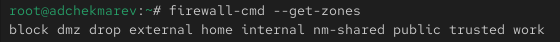

Посмотрим службы, доступные на нашем компьютере, используя **firewall-cmd --get-services**


Определим доступные службы в текущей зоне: **firewall-cmd --list-services**

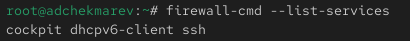

Сравним результаты вывода информации при использовании команды **firewall-cmd --list-all** и команды **firewall-cmd --list-all --zone=public**

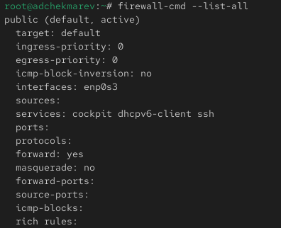


Добавим сервер VNC в конфигурацию брандмауэра: **firewall-cmd --add-service=vnc-server**

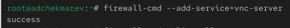

Проверим, добавился ли vnc-server в конфигурацию: **firewall-cmd --list-all**

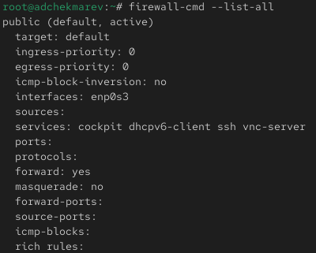

Перезапустим службу firewalld: **systemctl restart firewalld**
Проверим, есть ли vnc-server в конфигурации: **firewall-cmd --list-all**


Обратим внимание, что служба vnc-server больше не указана. Его нет, так как служба vnc-server не постоянная.

Добавим службу vnc-server ещё раз, но на этот раз сделаем её постоянной, используя команду **firewall-cmd --add-service=vnc-server --permanent**

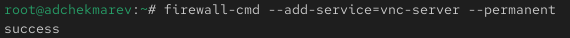

Проверим наличие vnc-server в конфигурации: **firewall-cmd --list-all**


Мы увидим, что VNC-сервер не указан. Службы, которые были добавлены в конфигурацию на диске, автоматически не добавляются в конфигурацию времени выполнения.

Перезагрузим конфигурацию firewalld и просмотрим конфигурацию времени выполнения:

```
firewall-cmd --reload
firewall-cmd --list-all
```

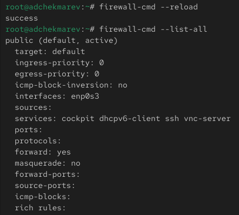

Добавим в конфигурацию межсетевого экрана порт 2022 протокола TCP и перезагрузим конфигурацию firewalld

```
firewall-cmd --add-port=2022/tcp --permanent
firewall-cmd --reload
```

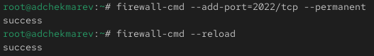

Проверим, что порт добавлен в конфигурацию: **firewall-cmd --list-all**


## Управление брандмауэром с помощью firewall-config

Откроем терминал и под учётной записью своего пользователя запустим интерфейс GUI firewall-config: **firewall-config**
Если служба отсутствует, то система предложит её установить. Также при запуске потребуется ввести пароль пользователя с полномочиями управления этой службой.

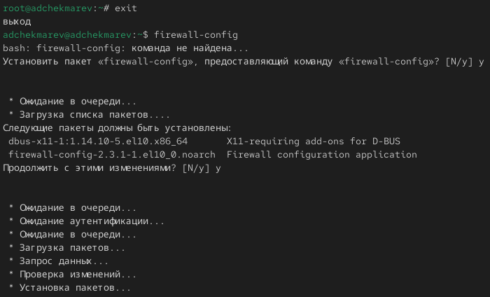

Нажмем на выпадающее меню рядом с параметром Configuration. Откроем раскрывающийся список и выберите Permanent. Это позволит сделать постоянными все изменения, которые мы вносим при конфигурировании.

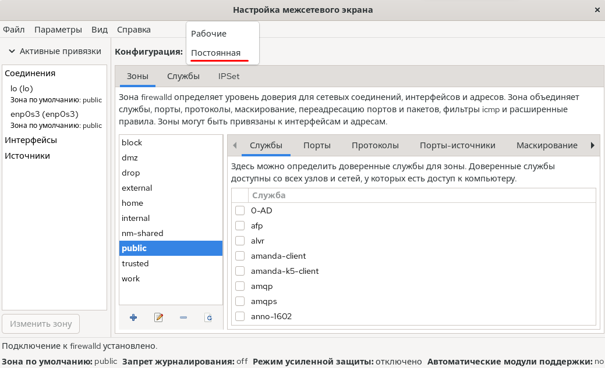

Выберем зону public и отметим службы **http**, **https** и **ftp**, чтобы включить их.


 

Выберем вкладку Ports и на этой вкладке нажмем Add. Введем порт **2022** и протокол **udp**, нажмем ОК, чтобы добавить их в список.


Закроем утилиту firewall-config.
В окне терминала введем **firewall-cmd --list-all**


Обратим внимание, что изменения, которые мы только что внесли, ещё не вступили в силу. Это связано с тем, что мы настроили их как постоянные изменения, а не как изменения времени выполнения.

Перегрузим конфигурацию firewall-cmd и просмотрим список доступных сервисов:

```
firewall-cmd --reload
firewall-cmd --list-all
```

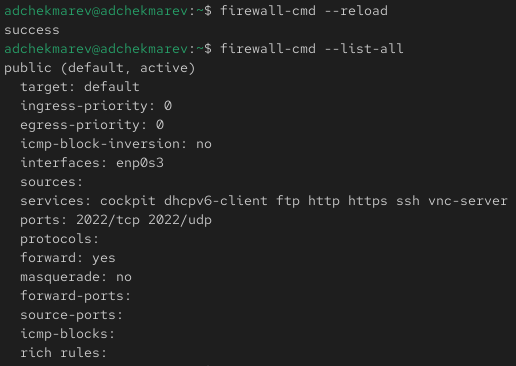

Как видим, изменения были применены

# Самостоятельная работа

Создадим конфигурацию межсетевого экрана, которая позволяет получить доступ к следующим службам:
– telnet;
– imap;
– pop3;
– smtp.

Сделаем это как в командной строке для службы telnet: **firewall-cmd --add-service=telnet --permanent**

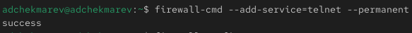 

Так и в графическом интерфейсе для служб imap, pop3, smtp.

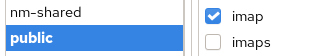

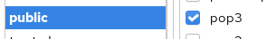

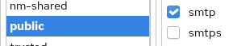

Убедимся, что конфигурация является постоянной и будет активирована после перезагрузки компьютера.

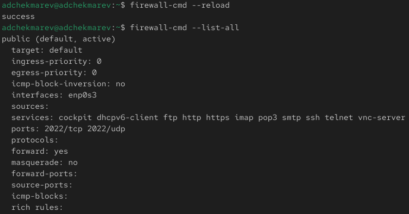


# Контрольные вопросы

1. Какая служба должна быть запущена перед началом работы с менеджером конфигурации брандмауэра firewall-config?

**sudo systemctl start firewalld**

2. Какая команда позволяет добавить UDP-порт 2355 в конфигурацию брандмауэра в зоне по умолчанию?

**firewall-cmd --add-port=2355/udp --permanent**

3. Какая команда позволяет показать всю конфигурацию брандмауэра во всех зонах?

**firewall-cmd --list-all-zones**

4. Какая команда позволяет удалить службу vnc-server из текущей конфигурации брандмауэра?

**firewall-cmd --remove-service=vnc-server**

5. Какая команда firewall-cmd позволяет активировать новую конфигурацию, добавленную опцией --permanent?

**firewall-cmd --reload**

6. Какой параметр firewall-cmd позволяет проверить, что новая конфигурация была добавлена в текущую зону и теперь активна?

**firewall-cmd --list-all --zone="zone-name"**

7. Какая команда позволяет добавить интерфейс eno1 в зону public?

**firewall-cmd --zone=public --change-interface=eno1**

8. Если добавить новый интерфейс в конфигурацию брандмауэра, пока не указана зона, в какую зону он будет добавлен?

В зону по умолчанию **firewall-cmd --get-default-zone**

# Выводы

В ходе выполнения лабораторной работы мы получили навыки настройки пакетного фильтра в Linux.


# Список литературы{.unnumbered}

::: {#refs}
:::
